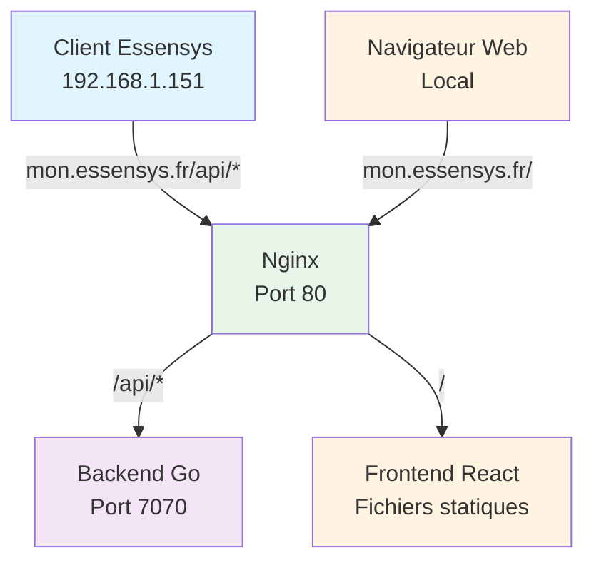
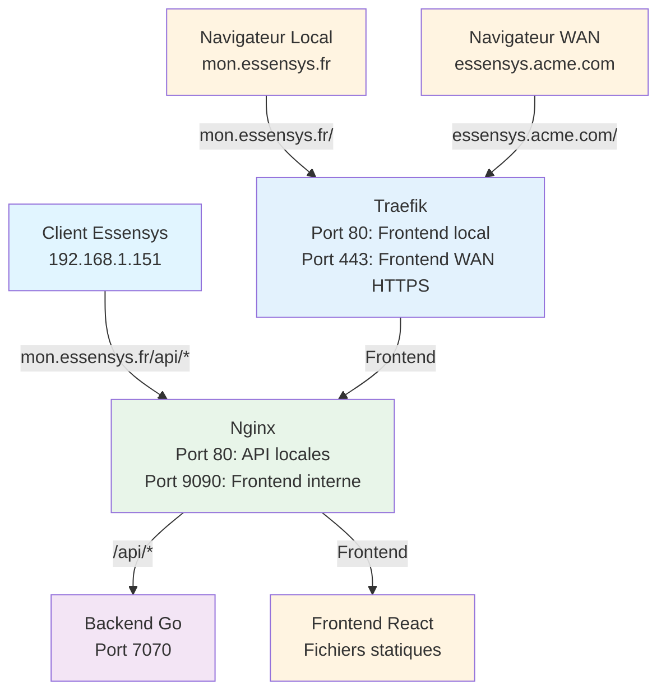
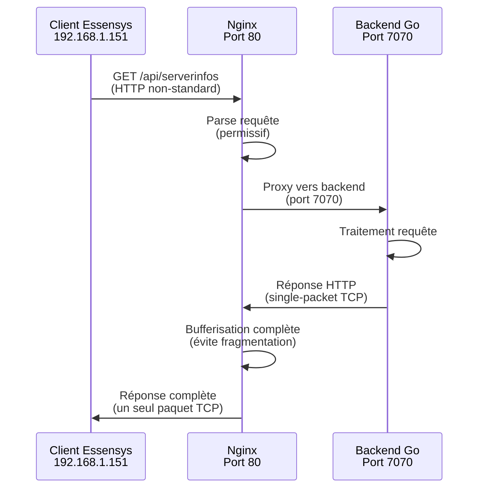
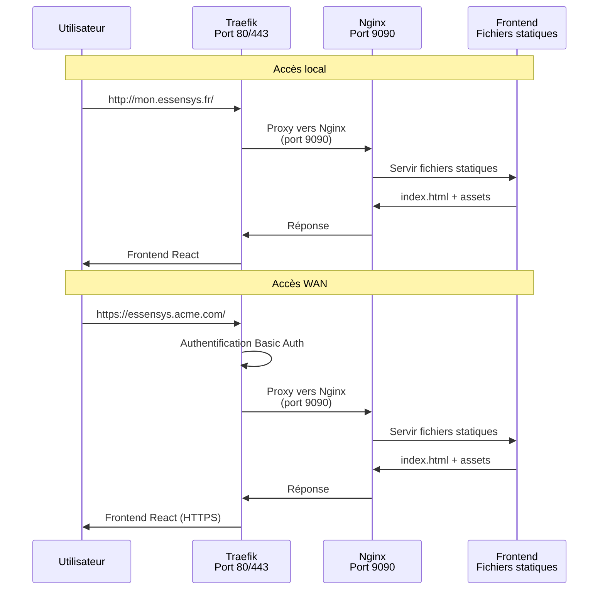

# Installation Essensys sur Raspberry Pi 4

Ce projet contient les scripts d'installation pour déployer le backend et le frontend Essensys sur un Raspberry Pi 4.

## Architecture

L'installation configure une architecture simplifiée avec deux modes de déploiement :

### Mode Standard (Nginx uniquement)

- **Backend Go** : Écoute sur le port 7070, gère les API et la communication avec les clients BP_MQX_ETH
- **Frontend React** : Application web compilée et servie par Nginx
- **Nginx** : Reverse proxy sur le port 80 qui :
  - Sert le frontend React sur `/`
  - Proxy les requêtes `/api/*` vers le backend sur le port 7070
  - Compatible avec le client Essensys legacy (BP_MQX_ETH) qui nécessite des réponses en un seul paquet TCP

### Mode Traefik (Nginx + Traefik)

- **Backend Go** : Port 7070 (géré par Nginx pour les API locales)
- **Frontend React** : Servi par Nginx sur port 9090 (interne)
- **Nginx** : Port 80 pour les API locales (client Essensys legacy)
- **Traefik** : Reverse proxy avancé qui :
  - Gère le frontend local (`mon.essensys.fr`) → Nginx port 9090
  - Gère le frontend WAN (`essensys.acme.com`) → Nginx port 9090 avec authentification HTTPS
  - Gère les certificats Let's Encrypt automatiquement

### Diagrammes d'architecture

#### Architecture simplifiée (mode standard)



#### Architecture avec Traefik (mode avancé)



#### Flux de communication détaillé



#### Flux frontend avec Traefik



## Prérequis

- Raspberry Pi 4 avec Raspberry Pi OS (Debian-based)
- Accès root (sudo)
- Connexion Internet pour télécharger les dépendances
- **Git installé** : Le script installera automatiquement git s'il n'est pas déjà présent

**Note** : Le script d'installation installe automatiquement toutes les dépendances nécessaires, y compris :
- git (pour cloner les dépôts depuis GitHub via HTTPS)
- curl, wget (pour télécharger les fichiers)
- build-essential (pour compiler le backend Go)
- nginx (serveur web)
- ca-certificates (pour les connexions HTTPS sécurisées)

Les dépôts sont publics et accessibles via HTTPS, aucune configuration SSH n'est nécessaire.

## Installation

### Installation automatique (recommandée)

1. Cloner ce dépôt :
```bash
git clone <url-du-repo-essensys-raspberry-install>
cd essensys-raspberry-install
```

2. (Optionnel) Créer le fichier `domain.txt` pour le domaine WAN :
```bash
echo "essensys.acme.com" > /home/essensys/domain.txt
```
Si ce fichier n'existe pas, le domaine par défaut `essensys.acme.com` sera utilisé.

3. Exécuter le script d'installation :
```bash
sudo ./install.sh
```

Le script `install.sh` installe **tout** :
- Mise à jour du système
- Installation des dépendances système (git, curl, wget, build-essential, nginx, apache2-utils, python3, etc.)
- Installation de Go, Node.js, npm
- Installation de Nginx
- Installation de Traefik
- Création de l'utilisateur `essensys` avec home directory `/home/essensys`
- Clonage des dépôts backend et frontend depuis GitHub (HTTPS) dans `/home/essensys`
- Compilation du backend Go (port 7070)
- Build du frontend React
- Configuration de Nginx (port 80 pour API locales, port 9090 pour frontend interne)
- Configuration de Traefik (port 80 pour frontend local, port 443 pour frontend WAN)
- Création de tous les services systemd (backend, nginx, traefik, traefik-block-service)
- Démarrage de tous les services

### Installation manuelle

Si vous préférez cloner manuellement les dépôts :

1. Créer l'utilisateur et cloner les projets :
```bash
sudo useradd -m -s /bin/bash essensys
sudo -u essensys bash -c "cd /home/essensys && git clone https://github.com/essensys-hub/essensys-server-backend.git"
sudo -u essensys bash -c "cd /home/essensys && git clone https://github.com/essensys-hub/essensys-server-frontend.git"
```

2. Exécuter le script d'installation (il détectera les dépôts existants et les mettra à jour).

## Structure après installation

```
/home/essensys/
├── essensys-server-backend/    # Dépôt cloné depuis GitHub
└── essensys-server-frontend/   # Dépôt cloné depuis GitHub

/opt/essensys/
├── backend/
│   ├── server          # Binaire compilé
│   ├── config.yaml     # Configuration
│   └── ...
├── frontend/
│   ├── dist/           # Frontend compilé
│   └── ...
└── logs/               # Logs de l'application
```

## Configuration

### Backend

Le fichier de configuration se trouve dans `/opt/essensys/backend/config.yaml`.

Pour modifier la configuration :
```bash
sudo nano /opt/essensys/backend/config.yaml
sudo systemctl restart essensys-backend
```

**Note** : Le backend écoute sur le port **7070** (et non 8080) pour éviter les conflits avec Traefik.

### Nginx

La configuration nginx se trouve dans `/etc/nginx/sites-available/essensys`.

Pour modifier la configuration :
```bash
sudo nano /etc/nginx/sites-available/essensys
sudo nginx -t  # Vérifier la configuration
sudo systemctl reload nginx
```

**Configuration API** : Nginx proxy les requêtes `/api/*` vers le backend sur le port **7070** avec une configuration spéciale pour le client Essensys legacy (single-packet TCP, headers non-standard).

### Traefik (mode avancé)

#### Fichier `domain.txt` - Configuration du domaine WAN

Le fichier `/home/essensys/domain.txt` contient le domaine WAN utilisé par Traefik pour l'accès HTTPS depuis Internet.

**Création du fichier** :
```bash
# Créer le fichier avec votre domaine WAN
echo "essensys.acme.com" > /home/essensys/domain.txt

# Vérifier le contenu
cat /home/essensys/domain.txt
```

**Format** :
- Une seule ligne contenant le nom de domaine complet (sans `http://` ou `https://`)
- Exemple : `essensys.acme.com`
- Le domaine doit pointer vers l'IP publique de votre routeur (NAT/port forwarding configuré)

**Utilisation** :
- Le script `install-traefik.sh` lit ce fichier pour configurer les routes WAN
- Le script `update-traefik.sh` lit ce fichier lors des mises à jour
- Si le fichier n'existe pas, le domaine par défaut `essensys.acme.com` est utilisé

**Configuration Traefik** :
```bash
# Configuration principale
sudo nano /etc/traefik/traefik.yml

# Routes locales
sudo nano /etc/traefik/dynamic/local-routes.yml

# Routes WAN
sudo nano /etc/traefik/dynamic/wan-routes.yml

# Vérifier la configuration
sudo systemctl restart traefik
```

**Authentification WAN** :
```bash
# Générer le fichier htpasswd pour l'authentification
sudo /home/essensys/essensys-raspberry-install/traefik-config/generate-htpasswd.sh username
```

## Gestion des services

### Démarrer les services
```bash
sudo systemctl start essensys-backend
sudo systemctl start nginx
```

### Arrêter les services
```bash
sudo systemctl stop essensys-backend
sudo systemctl stop nginx
```

### Redémarrer les services
```bash
sudo systemctl restart essensys-backend
sudo systemctl restart nginx
```

### Vérifier le statut
```bash
sudo systemctl status essensys-backend
sudo systemctl status nginx
```

### Activer le démarrage automatique
```bash
sudo systemctl enable essensys-backend
sudo systemctl enable nginx
```

## Logs

### Backend
Les logs du backend sont écrits dans `/var/logs/Essensys/backend/console.out.log` :

```bash
# Voir les logs en temps réel
sudo tail -f /var/logs/Essensys/backend/console.out.log

# Voir les dernières lignes
sudo tail -n 50 /var/logs/Essensys/backend/console.out.log

# Voir tout le fichier de log
sudo cat /var/logs/Essensys/backend/console.out.log

# Vider les logs (si nécessaire)
sudo truncate -s 0 /var/logs/Essensys/backend/console.out.log
```

**Note** : Les logs sont également disponibles via journalctl (pour compatibilité) :
```bash
sudo journalctl -u essensys-backend -f
```

### Nginx
```bash
# Logs d'erreur généraux
sudo tail -f /var/log/nginx/essensys-error.log

# Logs d'accès généraux
sudo tail -f /var/log/nginx/essensys-access.log

# Logs détaillés des API (diagnostic client legacy)
sudo tail -f /var/log/nginx/essensys-api-detailed.log

# Logs d'erreur détaillés des API
sudo tail -f /var/log/nginx/essensys-api-error.log

# Utiliser le script de visualisation (plus lisible)
./view-api-logs.sh -f                    # Suivre tous les logs API en temps réel
./view-api-logs.sh -m -n 100             # Afficher les 100 dernières requêtes mystatus
./view-api-logs.sh -e                    # Afficher les erreurs
./view-api-logs.sh -s -f                 # Suivre les requêtes serverinfos en temps réel
./view-api-logs.sh -a                    # Filtrer les requêtes myactions
./view-api-logs.sh -d                    # Filtrer les requêtes done
./view-api-logs.sh -i                    # Filtrer les requêtes admin/inject
```

**Note**: Les logs API détaillés incluent:
- Adresse IP source
- Méthode HTTP et URI complète
- Temps de réponse (request_time, upstream_connect_time, upstream_response_time)
- Headers HTTP (Content-Type, Content-Length, Connection)
- Informations upstream (adresse, statut, taille de réponse)
- Tous les détails nécessaires pour diagnostiquer les problèmes avec le client legacy qui ne respecte pas le standard HTTP

## Tests

### Vérifier que le backend fonctionne
```bash
# Health check direct (port 7070)
curl http://localhost:7070/health

# Health check via nginx
curl http://localhost/health

# Test API
curl http://localhost/api/serverinfos
```

### Vérifier que le frontend fonctionne
```bash
# Ouvrir dans un navigateur
http://<ip-du-raspberry-pi>
```

### Vérifier les ports
```bash
# Vérifier que nginx écoute sur le port 80
sudo ss -tlnp | grep :80

# Vérifier que le backend écoute sur le port 7070
sudo ss -tlnp | grep :7070

# Vérifier que Nginx écoute sur le port 9090 (frontend interne pour Traefik)
sudo ss -tlnp | grep :9090

# Vérifier que Traefik écoute sur les ports 80 et 443 (si installé)
sudo ss -tlnp | grep -E ':(80|443)'
```

## Configuration réseau

### Problème : L'interface Ethernet (eth0) ne démarre pas

Si vous ne pouvez pas démarrer l'interface Ethernet sur votre Raspberry Pi 4, utilisez les scripts de configuration réseau fournis.

#### Solution rapide : Réactiver l'interface

```bash
sudo ./fix-network.sh
```

Ce script va :
- Arrêter puis réactiver l'interface eth0
- Redémarrer le service dhcpcd
- Vérifier la configuration IP
- Tester la connectivité

#### Configuration complète du réseau

Pour configurer le réseau (DHCP ou IP statique) :

```bash
sudo ./configure-network.sh
```

Le script vous demandera :
- **Mode DHCP** : Configuration automatique via votre routeur
- **IP statique** : Configuration manuelle avec IP, masque, gateway et DNS

**Exemple de configuration IP statique :**
- Adresse IP : `192.168.1.37`
- Masque : `24` (ou `255.255.255.0`)
- Passerelle : `192.168.1.1`
- DNS : `8.8.8.8 8.8.4.4`

#### Commandes manuelles de dépannage réseau

```bash
# Vérifier l'état de l'interface
ip link show eth0

# Activer l'interface
sudo ip link set eth0 up

# Vérifier l'adresse IP
ip addr show eth0

# Redémarrer le service réseau
sudo systemctl restart dhcpcd

# Tester la connectivité
ping -c 3 8.8.8.8

# Vérifier la configuration dans /etc/dhcpcd.conf
cat /etc/dhcpcd.conf
```

#### Configuration SSH sans mot de passe

Une fois que l'interface eth0 fonctionne et que vous avez une IP (ex: 192.168.1.37), vous pouvez vous connecter en SSH :

```bash
# Depuis votre machine locale
ssh essensys@192.168.1.37
```

Si vous avez déjà configuré l'accès SSH sans mot de passe, la connexion devrait fonctionner automatiquement.

## Dépannage

### Le backend ne démarre pas

1. Vérifier les logs :
```bash
sudo journalctl -u essensys-backend -n 100
```

2. Vérifier que le binaire existe et est exécutable :
```bash
ls -la /opt/essensys/backend/server
```

3. Vérifier la configuration :
```bash
cat /opt/essensys/backend/config.yaml
```

### Nginx ne démarre pas

1. Vérifier la configuration :
```bash
sudo nginx -t
```

2. Vérifier les logs :
```bash
sudo tail -f /var/log/nginx/error.log
```

3. Vérifier que le port 80 n'est pas utilisé par un autre service :
```bash
sudo lsof -i :80
```

### Le frontend ne s'affiche pas

1. Vérifier que le build existe :
```bash
ls -la /opt/essensys/frontend/dist
```

2. Vérifier les logs nginx :
```bash
sudo tail -f /var/log/nginx/essensys-error.log
```

3. Vérifier les permissions :
```bash
sudo ls -la /opt/essensys/frontend/dist
```

### Les clients BP_MQX_ETH ne peuvent pas se connecter

1. Vérifier que nginx écoute sur le port 80 :
```bash
sudo netstat -tlnp | grep :80
```

2. Vérifier que le backend fonctionne :
```bash
curl http://localhost:7070/health
```

3. Vérifier que nginx proxy correctement :
```bash
curl http://localhost/api/serverinfos
```

4. Vérifier le firewall (si activé) :
```bash
sudo ufw status
sudo ufw allow 80/tcp
```

## Mise à jour

### Script automatique (recommandé)

Un script `update.sh` unifié est fourni pour automatiser la mise à jour complète :

```bash
cd essensys-raspberry-install
sudo ./update.sh
```

Ce script va :
- Mettre à jour les dépôts backend et frontend depuis GitHub
- Recompiler le backend Go
- Rebuild le frontend React
- Mettre à jour la configuration Nginx
- Mettre à jour la configuration Traefik (lit `/home/essensys/domain.txt` pour le domaine WAN)
- Redémarrer tous les services (essensys-backend, nginx, traefik, traefik-block-service)
- Vérifier que tous les services sont actifs

### Mise à jour manuelle

#### Mettre à jour le backend

```bash
# Mettre à jour depuis GitHub
cd /home/essensys/essensys-server-backend
sudo -u essensys git pull

# Recompiler et copier
cd /opt/essensys/backend
export PATH=$PATH:/usr/local/go/bin
go mod tidy
go build -o server ./cmd/server

# Redémarrer le service
sudo systemctl restart essensys-backend
```

#### Mettre à jour le frontend

```bash
# Mettre à jour depuis GitHub
cd /home/essensys/essensys-server-frontend
sudo -u essensys git pull

# Rebuild et copier
cd /opt/essensys/frontend
sudo -u essensys npm install
sudo -u essensys npm run build

# Recharger nginx
sudo systemctl reload nginx
```

## Désinstallation

### Script automatique (recommandé)

Un script `uninstall.sh` unifié est fourni pour automatiser la désinstallation complète :

```bash
cd essensys-raspberry-install
sudo ./uninstall.sh
```

Le script va :
- Demander confirmation avant de supprimer
- Arrêter et désactiver tous les services (essensys-backend, traefik, traefik-block-service, nginx)
- Supprimer tous les fichiers de service systemd
- Supprimer la configuration Nginx (essensys, essensys-frontend-internal)
- Supprimer la configuration Traefik (`/etc/traefik`)
- Supprimer les binaires (traefik, traefik-block-service.py)
- Supprimer les fichiers d'installation dans `/opt/essensys`
- Supprimer tous les logs (`/var/logs/Essensys`, `/var/log/traefik`, logs nginx)
- Optionnellement supprimer l'utilisateur et les dépôts

### Désinstallation manuelle

Si vous préférez désinstaller manuellement :

```bash
# Arrêter et désactiver les services
sudo systemctl stop essensys-backend
sudo systemctl disable essensys-backend

# Supprimer les fichiers de service
sudo rm /etc/systemd/system/essensys-backend.service
sudo systemctl daemon-reload
sudo systemctl reset-failed

# Supprimer la configuration nginx
sudo rm /etc/nginx/sites-available/essensys
sudo rm /etc/nginx/sites-enabled/essensys
sudo systemctl reload nginx

# Supprimer les fichiers d'installation
sudo rm -rf /opt/essensys

# Supprimer les logs
sudo rm -rf /var/logs/Essensys
sudo rm -f /var/log/nginx/essensys-*.log

# Supprimer l'utilisateur (optionnel)
sudo userdel -r essensys
```

## Sécurité

### Recommandations

1. **Changer les mots de passe par défaut** dans `config.yaml`
2. **Activer l'authentification** si nécessaire :
```yaml
auth:
  enabled: true
  clients:
    client1: motdepasse_securise
```

3. **Configurer un firewall** :
```bash
sudo ufw enable
sudo ufw allow 80/tcp
sudo ufw allow 22/tcp  # SSH
```

4. **Mettre à jour régulièrement** le système :
```bash
sudo apt update && sudo apt upgrade -y
```

5. **Utiliser HTTPS** en production (nécessite un certificat SSL)

**Note** : Le script `install.sh` installe automatiquement Nginx ET Traefik. L'architecture est configurée comme suit :
- **Nginx** : Gère les API locales (port 80) pour le client Essensys legacy
- **Traefik** : Gère le frontend local (port 80) et WAN (port 443 avec HTTPS et authentification)

**Prérequis pour l'accès WAN** :
1. Créer le fichier `/home/essensys/domain.txt` avec votre domaine WAN :
   ```bash
   echo "essensys.acme.com" > /home/essensys/domain.txt
   ```
2. Configurer le NAT/port forwarding sur votre routeur (ports 80 et 443 vers l'IP du Raspberry Pi)
3. Configurer le DNS pour pointer votre domaine WAN vers votre IP publique

**Voir la documentation complète** : `traefik-config/README.md`

## Ports utilisés

| Service | Port | Description |
|---------|------|-------------|
| Nginx | 80 | Frontend local + API locales (client Essensys) |
| Nginx | 9090 | Frontend interne (utilisé par Traefik) |
| Backend Go | 7070 | API backend (proxied par Nginx) |
| Traefik | 80 | Frontend local (proxy vers Nginx 9090) |
| Traefik | 443 | Frontend WAN HTTPS (proxy vers Nginx 9090) |
| Traefik | 8081 | API interne Traefik (dashboard) |

## Support

Pour toute question ou problème, consultez :
- La documentation du backend : `essensys-server-backend/README.md`
- La documentation du frontend : `essensys-server-frontend/README.md`
- La documentation Traefik : `traefik-config/README.md`
- La documentation client legacy : `client-essensys-legacy/README.md`

## Licence

Voir le fichier LICENSE pour plus d'informations.
