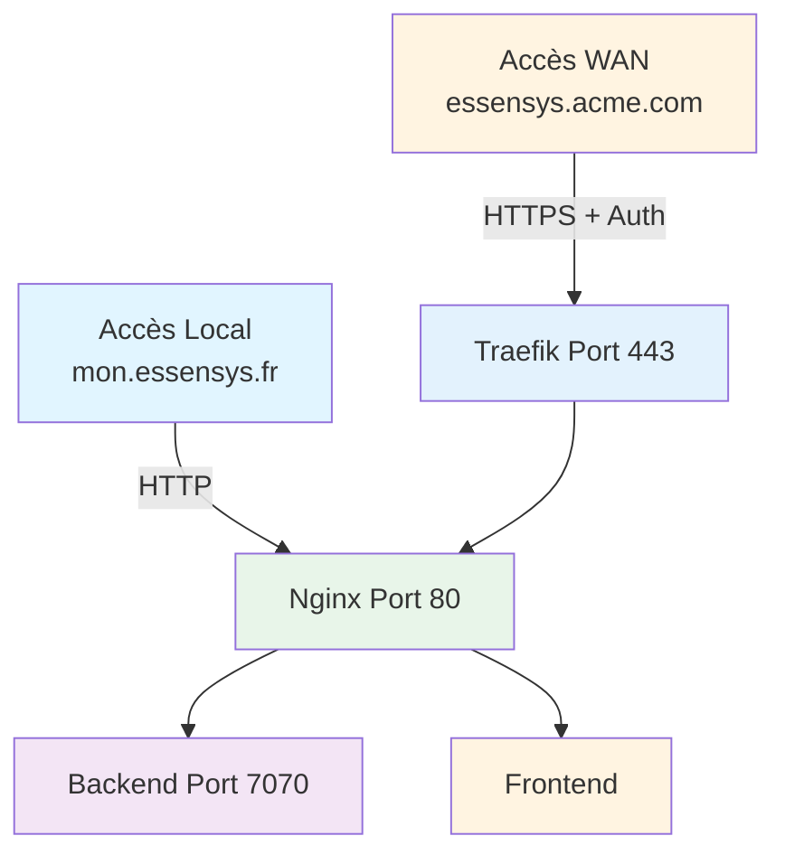

# Accès aux services

Cette section explique comment accéder aux services Essensys en local et depuis Internet (WAN).

## Sections

1. **[Accès local](local.md)** - Accéder aux services depuis le réseau local
2. **[Accès WAN](wan.md)** - Accéder aux services depuis Internet

## Vue d'ensemble

