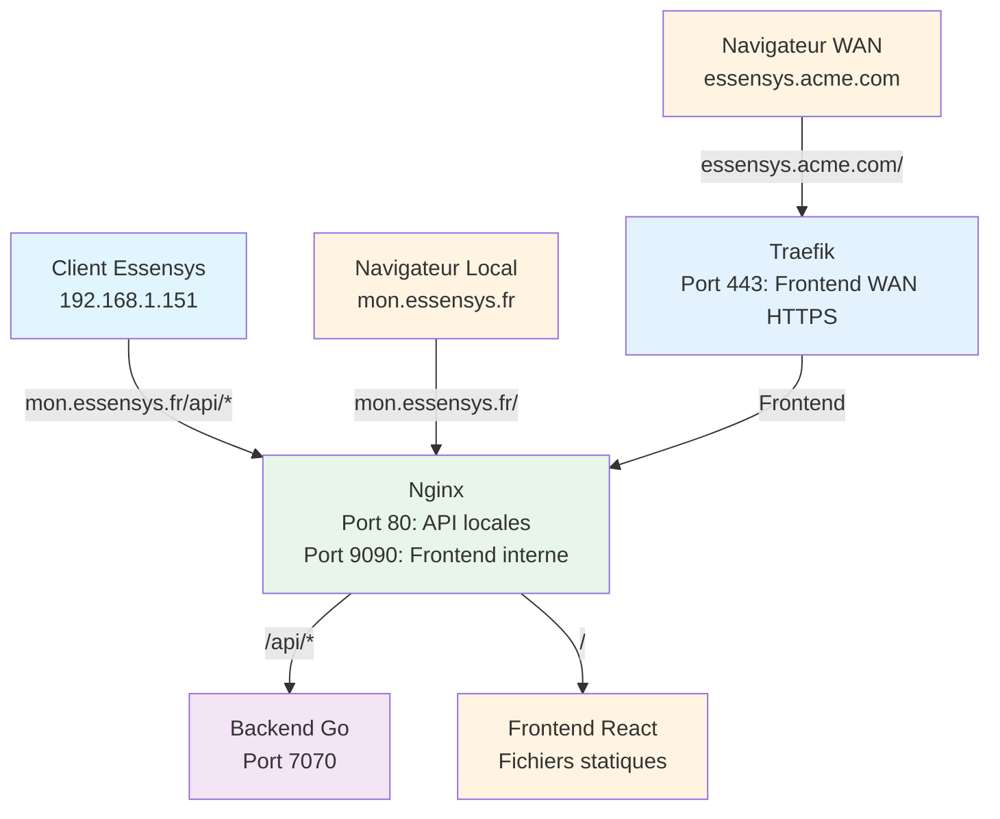
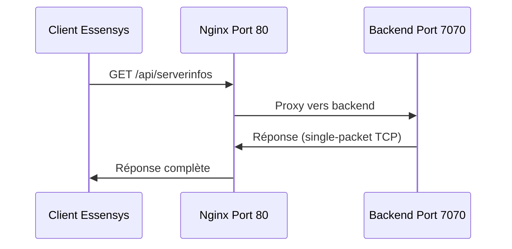
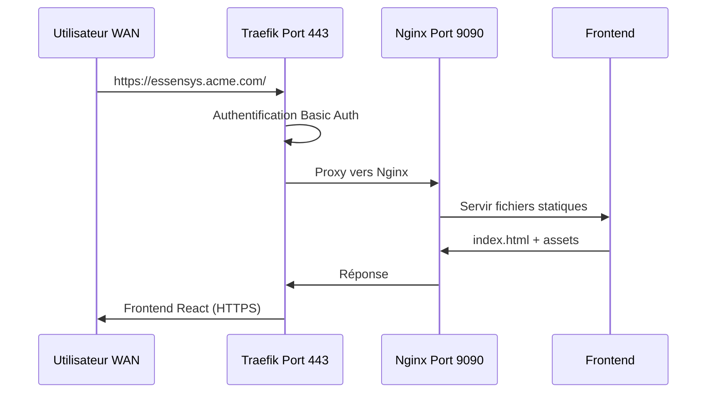

# Architecture

Vue d'ensemble de l'architecture Essensys sur Raspberry Pi.

## Composants

1. **[Backend](backend.md)** - API Go et communication avec clients legacy
2. **[Frontend](frontend.md)** - Interface web React
3. **[Nginx](nginx.md)** - Reverse proxy pour API locales
4. **[Traefik](traefik.md)** - Reverse proxy pour accès WAN
5. **[Ports](ports.md)** - Ports utilisés par les services

## Architecture globale

## Flux de données

### Flux local (API)

### Flux WAN (Frontend)

