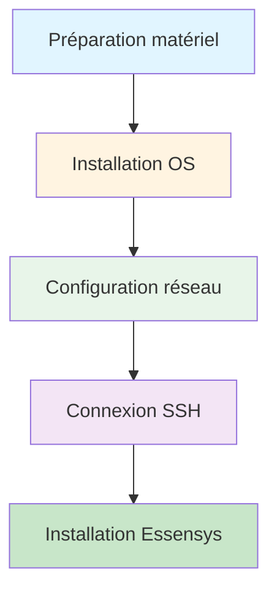

# Connexion au Raspberry Pi

Cette section explique comment se connecter au Raspberry Pi et configurer le réseau.

## Sections

1. **[Connexion SSH](ssh.md)** - Se connecter en SSH au Raspberry Pi
2. **[Configuration réseau](configuration-reseau.md)** - Configurer le réseau (DHCP ou IP statique)

## Vue d'ensemble

