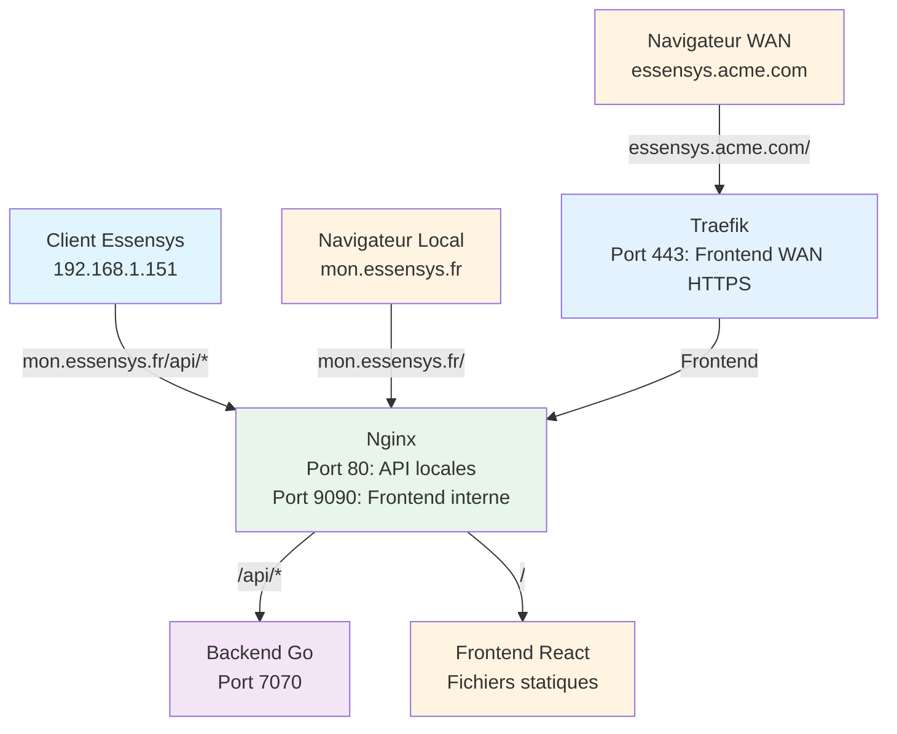

# Documentation Essensys Raspberry Pi

Bienvenue dans la documentation complète pour l'installation et la configuration d'Essensys sur Raspberry Pi 4.

## 🚀 Démarrage rapide

1. **[Préparation du matériel](installation/preparation.md)** - SSD, adaptateur USB-SATA, Raspberry Pi 4
2. **[Installation de l'OS](installation/os-installation.md)** - Installation de Raspberry Pi OS sur le SSD
3. **[Installation Essensys](installation/essensys-installation.md)** - Déploiement du backend et frontend
4. **[Configuration réseau](connexion/configuration-reseau.md)** - Configuration SSH et réseau
5. **[Accès aux services](acces/index.md)** - URLs locales et WAN

## 📚 Sections principales

### Installation
- [Préparation du matériel](installation/preparation.md)
- [Installation de l'OS](installation/os-installation.md)
- [Installation Essensys](installation/essensys-installation.md)

### Connexion
- [Connexion SSH](connexion/ssh.md)
- [Configuration réseau](connexion/configuration-reseau.md)

### Logs
- [Logs backend](logs/backend.md)
- [Logs Nginx](logs/nginx.md)
- [Logs Traefik](logs/traefik.md)

### Accès
- [Accès local](acces/local.md)
- [Accès WAN](acces/wan.md)

### Configuration Routeur
- [Ubiquiti Dream Machine Pro](router/ubiquiti-udm-pro.md)
- [Freebox](router/freebox.md)
- [SFR](router/sfr.md)
- [Orange Livebox](router/orange-livebox.md)

### Architecture
- [Vue d'ensemble](architecture/index.md)
- [Backend](architecture/backend.md)
- [Frontend](architecture/frontend.md)
- [Nginx](architecture/nginx.md)
- [Traefik](architecture/traefik.md)
- [Ports utilisés](architecture/ports.md)

### Maintenance
- [Mise à jour](maintenance/update.md)
- [Désinstallation](maintenance/uninstall.md)
- [Dépannage](maintenance/troubleshooting.md)

## 🏗️ Architecture

## 📦 Composants

- **Backend Go** : API REST et communication avec les clients Essensys legacy
- **Frontend React** : Interface web moderne
- **Nginx** : Reverse proxy pour les API locales et le frontend local
- **Traefik** : Reverse proxy avancé pour l'accès WAN avec HTTPS et authentification

## 🔒 Sécurité

- **Local** : Accès HTTP sans authentification
- **WAN** : Accès HTTPS avec authentification basique
- **API WAN** : Seul `/api/admin/inject` est accessible en WAN (HTTPS + auth)
- **Autres API WAN** : Bloquées (403 Forbidden)

## 📝 Notes importantes

- Le client Essensys legacy (BP_MQX_ETH) nécessite des réponses HTTP en un seul paquet TCP
- Nginx est configuré spécifiquement pour cette compatibilité
- Traefik gère uniquement le frontend WAN, les API locales restent sur Nginx

