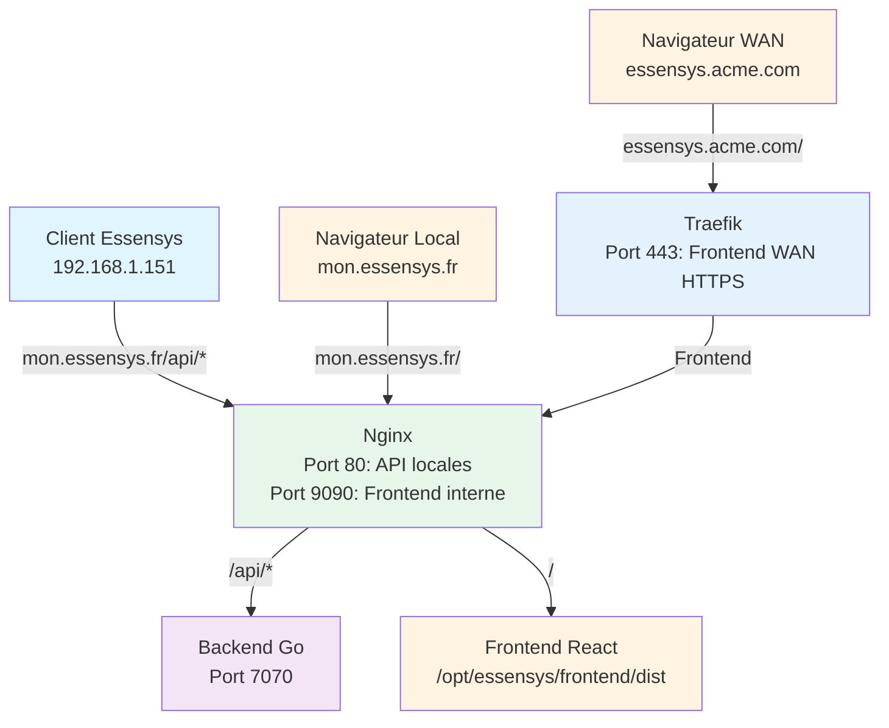

# Installation Essensys

Cette section explique comment installer Essensys (backend et frontend) sur le Raspberry Pi.

## Prérequis

- Raspberry Pi OS installé et fonctionnel
- Connexion SSH établie (voir [Connexion SSH](../connexion/ssh.md))
- Accès Internet sur le Raspberry Pi

## Installation automatique

### Étape 1 : Cloner le dépôt d'installation

```bash
cd /home/essensys
git clone https://github.com/essensys-hub/essensys-raspberry-install.git
cd essensys-raspberry-install
```

### Étape 2 : Exécuter le script d'installation

```bash
chmod +x install.sh
sudo ./install.sh
```

Le script va :

1. **Mettre à jour le système** (`apt update && apt upgrade`)
2. **Installer les dépendances** :
   - Go (langage du backend)
   - Node.js et npm (pour le frontend)
   - Nginx (reverse proxy)
   - Git
3. **Cloner les dépôts** :
   - `essensys-server-backend` dans `/home/essensys/essensys-server-backend`
   - `essensys-server-frontend` dans `/home/essensys/essensys-server-frontend`
4. **Compiler le backend** :
   - Résoudre les dépendances Go (`go mod tidy`)
   - Compiler le binaire
   - Copier dans `/opt/essensys/backend/`
5. **Compiler le frontend** :
   - Installer les dépendances npm
   - Builder l'application React
   - Copier dans `/opt/essensys/frontend/`
6. **Configurer Nginx** :
   - Créer la configuration pour servir le frontend et proxy les API
   - Activer le site Essensys
7. **Configurer Traefik** (optionnel) :
   - Télécharger et installer Traefik
   - Configurer les routes locales et WAN
   - Lire le domaine WAN depuis `/home/essensys/domain.txt`
8. **Créer les services systemd** :
   - `essensys-backend.service`
   - `essensys-frontend.service`
   - `traefik.service` (si installé)
   - `traefik-block-service.service` (si installé)

### Étape 3 : Configuration du domaine WAN (si Traefik installé)

Si vous souhaitez utiliser Traefik pour l'accès WAN :

```bash
echo "essensys.acme.com" > /home/essensys/domain.txt
```

Remplacez `essensys.acme.com` par votre domaine WAN réel.

### Étape 4 : Configuration de l'authentification WAN (si Traefik installé)

Créer un utilisateur pour l'authentification basique :

```bash
sudo /etc/traefik/generate-htpasswd.sh
```

Entrer un nom d'utilisateur et un mot de passe.

## Vérification de l'installation

### Vérifier les services

```bash
# Vérifier le statut des services
sudo systemctl status essensys-backend
sudo systemctl status essensys-frontend
sudo systemctl status nginx
sudo systemctl status traefik  # Si installé
```

### Vérifier les ports

```bash
# Vérifier que les ports sont en écoute
sudo netstat -tlnp | grep -E '7070|80|443|9090'
```

Vous devriez voir :
- Port 7070 : Backend Go
- Port 80 : Nginx
- Port 443 : Traefik (si installé)
- Port 9090 : Frontend interne (si Traefik installé)

### Tester l'accès local

Depuis un navigateur sur le même réseau :

- **Frontend** : `http://mon.essensys.fr/` ou `http://<ip-raspberry>/`
- **API** : `http://mon.essensys.fr/api/serverinfos`

## Architecture installée



## Structure des fichiers installés

```
/opt/essensys/
├── backend/
│   ├── server          # Binaire Go compilé
│   └── config.yaml     # Configuration backend
└── frontend/
    └── dist/           # Fichiers React compilés

/etc/nginx/
└── sites-available/
    └── essensys        # Configuration Nginx

/etc/traefik/           # Configuration Traefik (si installé)
├── traefik.yml
└── dynamic/
    ├── local-routes.yml
    └── wan-routes.yml

/etc/systemd/system/
├── essensys-backend.service
├── essensys-frontend.service
├── traefik.service
└── traefik-block-service.service

/var/logs/Essensys/
└── backend/
    └── console.out.log
```

## Prochaines étapes

Une fois l'installation terminée :

1. [Configuration réseau](../connexion/configuration-reseau.md) - Configurer DNS et réseau
2. [Configuration routeur](../router/index.md) - Configurer le NAT/port forwarding
3. [Accès local](../acces/local.md) - Tester l'accès local
4. [Accès WAN](../acces/wan.md) - Configurer l'accès WAN

## Dépannage

### Les services ne démarrent pas

```bash
# Vérifier les logs
sudo journalctl -u essensys-backend -n 50
sudo journalctl -u essensys-frontend -n 50
sudo journalctl -u nginx -n 50
```

### Erreur de compilation Go

```bash
cd /home/essensys/essensys-server-backend
go mod tidy
go build -o server ./cmd/server
```

### Erreur de build frontend

```bash
cd /home/essensys/essensys-server-frontend
npm install
npm run build
```

### Port déjà utilisé

```bash
# Trouver le processus utilisant le port
sudo lsof -i :7070
sudo lsof -i :80
sudo lsof -i :443

# Arrêter le processus si nécessaire
sudo kill <PID>
```

