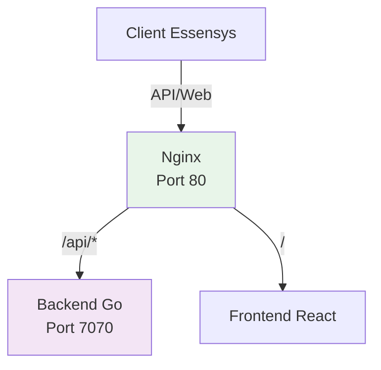

# Étape 4 : Installation d'Essensys

Cette section explique comment installer Essensys (backend et frontend) sur le Raspberry Pi en fonction de l'utilisateur que vous avez choisi lors de l'installation de l'OS.

## Prérequis

- [ ] Raspberry Pi OS installé et démarré.
- [ ] Connexion SSH établie.
- [ ] Accès Internet fonctionnel sur le Raspberry Pi.

---

## Méthode d'installation

Choisissez la méthode correspondant à votre nom d'utilisateur configuré à l'étape précédente.

=== "Utilisateur `essensys` (Recommandé)"

    Si vous avez respecté le nom d'utilisateur `essensys`, vous pouvez utiliser la commande rapide :

    1. **Connectez-vous en SSH** :
       ```bash
       ssh essensys@<ip-du-pi>
       ```

    2. **Lancez l'installation automatique** :
       ```bash
       sudo curl -sL https://raw.githubusercontent.com/essensys-hub/essensys-raspberry-install/refs/heads/V.1.1.0/install.sh | sudo bash
       ```

=== "Autre utilisateur (Personnalisé)"

    Si vous utilisez un nom d'utilisateur différent (ex: `pi`, `admin`), vous devez cloner le projet manuellement :

    1. **Connectez-vous en SSH** :
       ```bash
       ssh <votre-user>@<ip-du-pi>
       ```

    2. **Clonez le dépôt** :
       ```bash
       git clone https://github.com/essensys-hub/essensys-raspberry-install
       cd essensys-raspberry-install
       ```

    3. **Lancez l'installation avec votre utilisateur** :
       ```bash
       chmod +x install.sh
       sudo ./install.sh --user <votre-user>
       ```

---

## Options du script (Optionnel)

Le script `install.sh` accepte des arguments pour des configurations spécifiques :

| Option | Description |
| :--- | :--- |
| `--staging` | Active l'environnement de test (staging) pour Let's Encrypt. |
| `--user <username>` | Définit l'utilisateur cible (obligatoire si différent de `essensys`). |

## Architecture installée


```mermaid
graph TB
    Client[Client Essensys]
    Nginx[Nginx<br/>Port 80]
    Backend[Backend Go<br/>Port 7070]
    Frontend[Frontend React]
    
    Client -->|API/Web| Nginx
    Nginx -->|/api/*| Backend
    Nginx -->|/| Frontend
    
    style Nginx fill:#e8f5e9
    style Backend fill:#f3e5f5
```

---

!!! warning "L'adresse IP `192.168.1.151` utilisée dans cet exemple est fictive"
    Vous devez impérativement identifier l'adresse IP réelle de votre "essensys client" sur votre réseau local pour configurer les redirections de port correctement.

!!! success "Installation Terminée !"
    Félicitations ! Votre serveur Essensys est maintenant opérationnel.
    
    [:material-lan: **Configurer le réseau**](../connexion/configuration-reseau.md){ .md-button .md-button--primary }

## Dépannage

### Vérifier les services
```bash
sudo systemctl status essensys-backend
sudo systemctl status essensys-frontend
sudo systemctl status nginx
```


