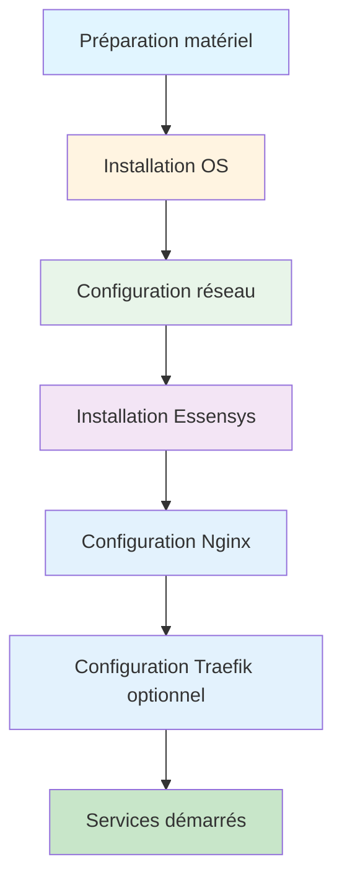

# Installation

Cette section couvre toutes les étapes d'installation, de la préparation du matériel à l'installation complète d'Essensys.

## Étapes d'installation

1. **[Préparation du matériel](preparation.md)** - Matériel nécessaire et préparation
2. **[Installation de l'OS](os-installation.md)** - Installation de Raspberry Pi OS sur le SSD
3. **[Installation Essensys](essensys-installation.md)** - Déploiement du backend et frontend

## Vue d'ensemble

