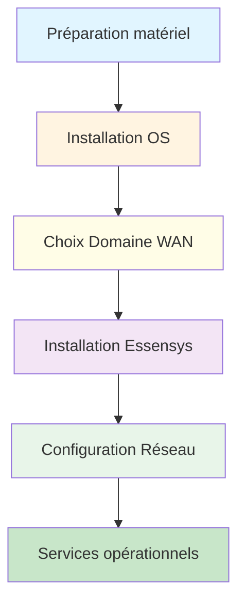

# Introduction à l'installation

Cette section vous guide pas à pas pour transformer votre Raspberry Pi en un serveur Essensys performant. Nous suivrons une approche séquentielle pour garantir une configuration stable.

[:material-play-circle: **Commencer l'installation**](preparation.md){ .md-button .md-button--primary }

## Étapes du parcours

1.  **Préparation du matériel** : Rassembler et vérifier les composants.
2.  **Installation de l'OS** : Flasher le SSD et configurer les accès initiaux.
3.  **Choix du Domaine WAN** : Configurer un nom de domaine DuckDNS ou personnalisé (Optionnel).
4.  **Installation Essensys** : Déployer le backend, le frontend et les services réseaux.

## Vue d'ensemble

```mermaid
flowchart TD
    A[Préparation matériel] --> B[Installation OS]
    B --> C[Choix Domaine WAN]
    C --> D[Installation Essensys]
    D --> E[Configuration Réseau]
    E --> F[Services opérationnels]
    
    style A fill:#e1f5ff
    style B fill:#fff4e1
    style C fill:#fffde7
    style D fill:#f3e5f5
    style E fill:#e8f5e9
    style F fill:#c8e6c9
```
