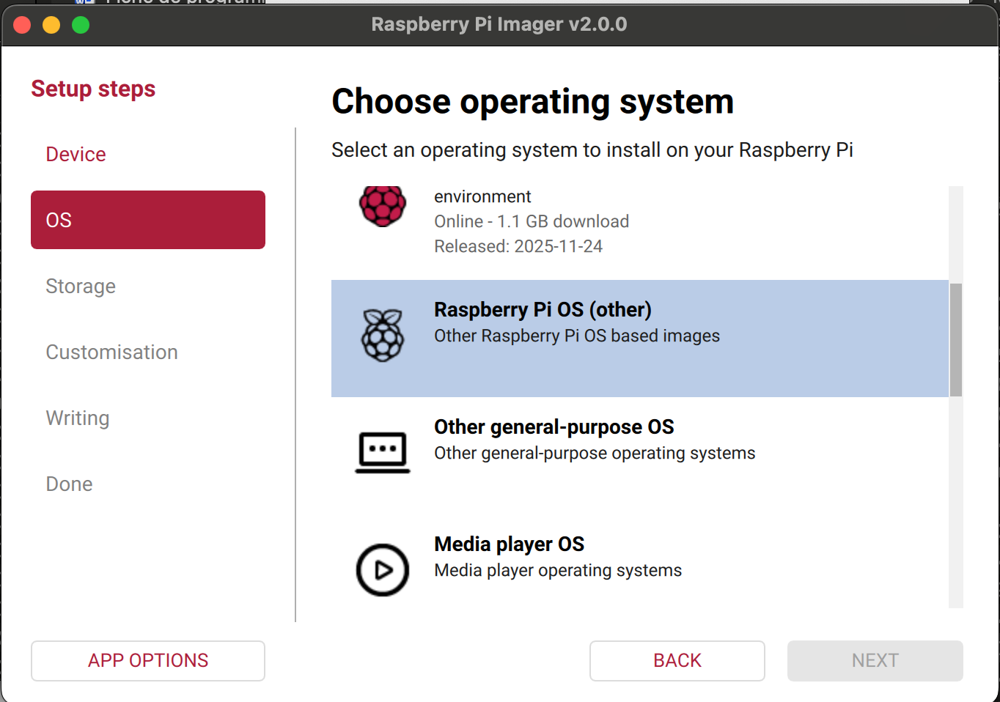
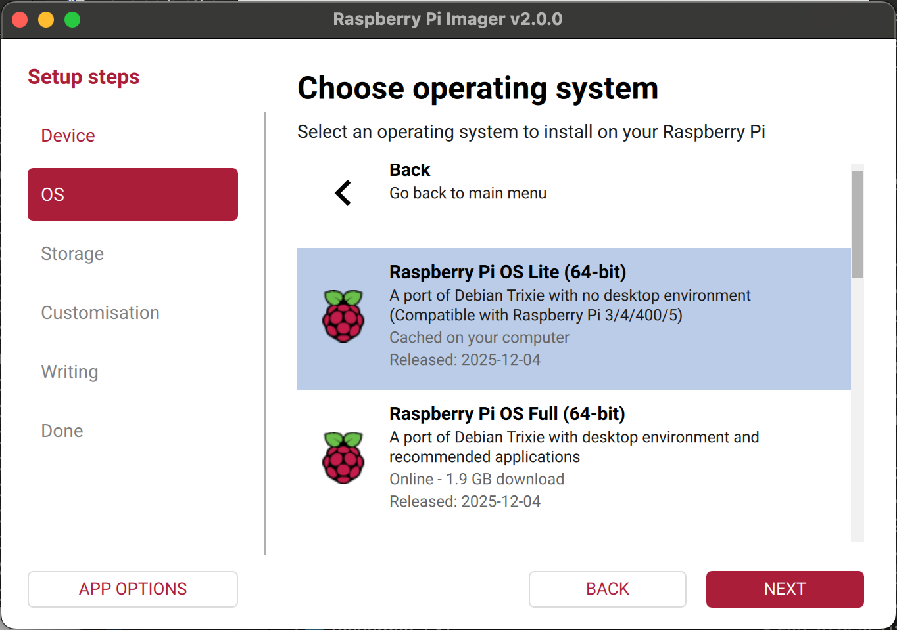
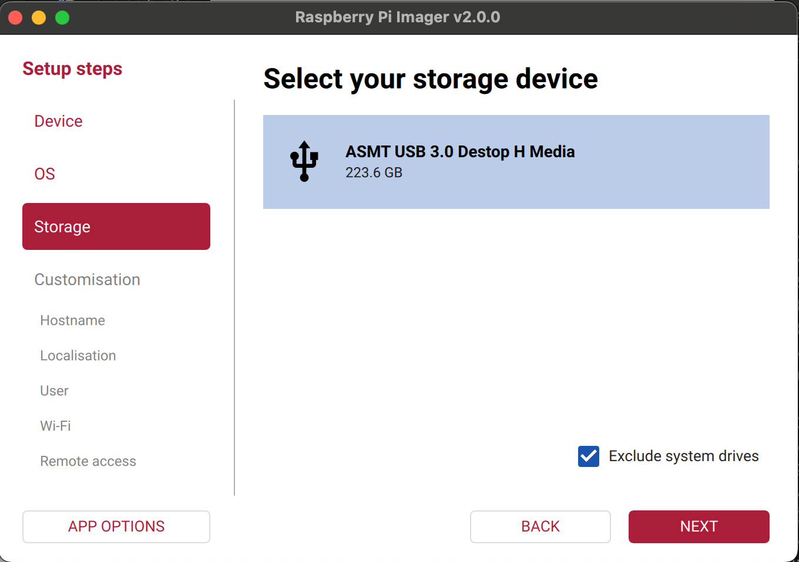
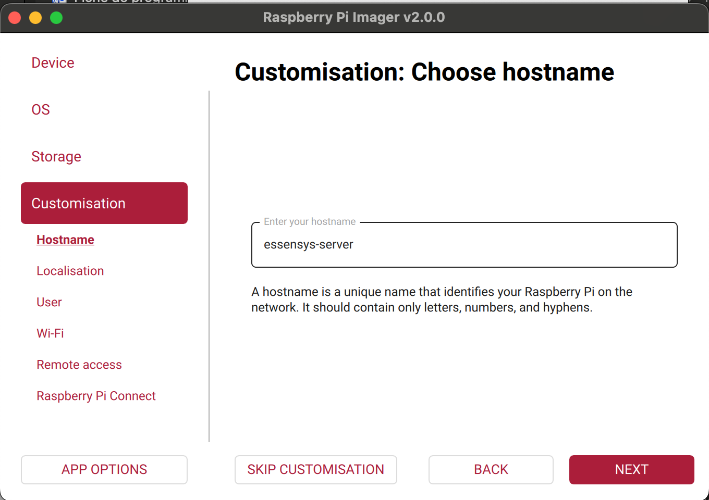
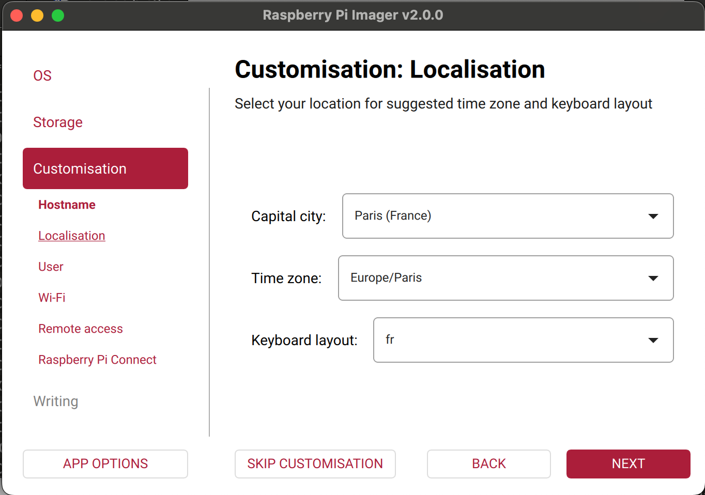
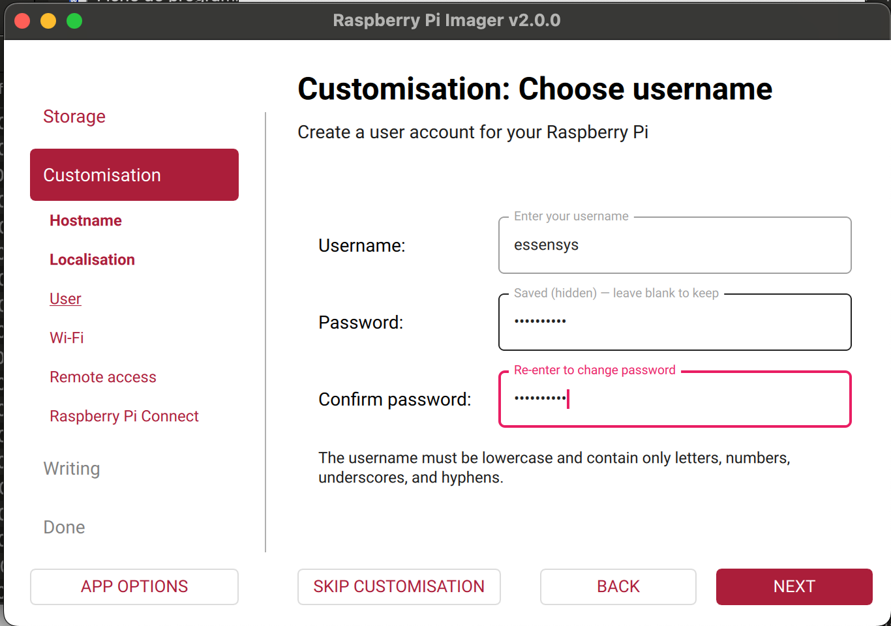
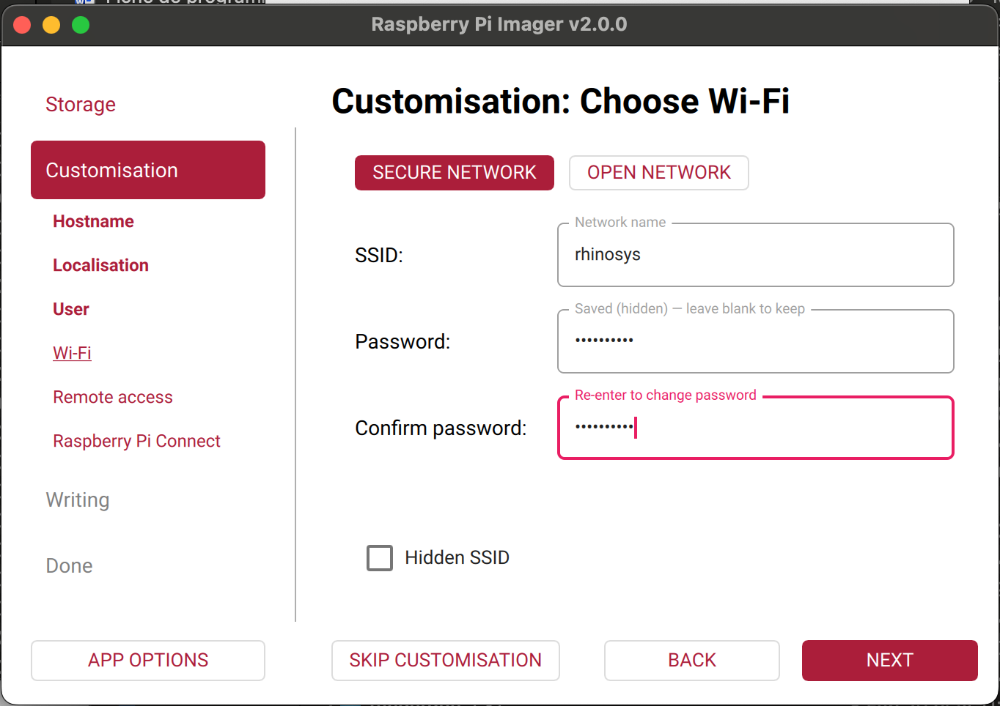

# Installation de l'OS sur le SSD

Cette section explique comment installer Raspberry Pi OS sur le SSD connecté via l'adaptateur USB-SATA.

## Prérequis

- Matériel préparé (voir [Préparation du matériel](preparation.md))
- Raspberry Pi Imager installé
- SSD connecté à l'ordinateur via l'adaptateur USB-SATA

## Étapes d'installation

### Étape 1 : Lancer Raspberry Pi Imager

1. Ouvrir **Raspberry Pi Imager**
2. Cliquer sur **"CHOOSE OS"** (Choisir l'OS)

### Étape 2 : Sélectionner l'OS

1. Choisir **"Raspberry Pi OS (64-bit)"** (recommandé)
   - Ou **"Raspberry Pi OS (32-bit)"** si nécessaire
2. Cliquer sur **"CHOOSE STORAGE"** (Choisir le stockage)

### Étape 3 : Sélectionner le SSD

1. Dans la liste des périphériques, sélectionner le **SSD** (pas la carte microSD)
2. Vérifier la capacité du disque (doit correspondre à votre SSD)

!!! warning "Attention"
    Assurez-vous de sélectionner le bon périphérique. Toutes les données sur le disque sélectionné seront effacées.

### Étape 4 : Configurer l'OS (optionnel mais recommandé)

Cliquer sur l'icône d'engrenage (⚙️) pour ouvrir les options avancées :

#### Options générales

- **Activer SSH** : ✅ Cocher "Enable SSH"
  - Utiliser l'authentification par clé publique (recommandé)
  - Ou définir un mot de passe pour l'utilisateur `pi`
  
- **Nom d'utilisateur et mot de passe** :
  - Nom d'utilisateur : `essensys` (recommandé)
  - Mot de passe : Définir un mot de passe fort

- **Configurer le Wi-Fi** (optionnel) :
  - SSID : Nom de votre réseau Wi-Fi
  - Mot de passe : Mot de passe Wi-Fi
  - Pays : Sélectionner votre pays

- **Configurer les paramètres régionaux** :
  - Timezone : `Europe/Paris` (ou votre fuseau horaire)
  - Keyboard layout : `fr` (ou votre disposition de clavier)

#### Options avancées

- **Activer le bureau** : Désactivé (mode headless recommandé)
- **Activer l'écran de démarrage** : Activé

### Étape 5 : Écrire l'image sur le SSD

1. Cliquer sur **"WRITE"** (Écrire)
2. Confirmer l'opération (toutes les données seront effacées)
3. Attendre la fin de l'écriture (peut prendre 10-30 minutes selon la taille du SSD)

### Étape 6 : Vérification

Une fois l'écriture terminée :

1. **Éjecter le SSD** proprement depuis votre ordinateur
2. **Déconnecter l'adaptateur USB-SATA** du SSD
3. **Brancher le SSD au Raspberry Pi** via l'adaptateur USB-SATA

## Installation sur le Raspberry Pi

### Étape 1 : Brancher le matériel


1. Connecter le **SSD au Raspberry Pi** via l'adaptateur USB-SATA
   - Utiliser un port USB 3.0 (bleu) si disponible pour de meilleures performances
   - Le port USB 3.0 se trouve sur le côté droit du Raspberry Pi 4
   
   
   
2. Connecter le **câble Ethernet** au Raspberry Pi
   - Le port Ethernet se trouve en haut à droite du Raspberry Pi
3. Connecter l'**alimentation** au Raspberry Pi
   - Utiliser le port USB-C (port d'alimentation) sur le côté gauche
   - Utiliser une alimentation officielle Raspberry Pi 4 (5V, 3A minimum)

### Étape 2 : Premier démarrage

1. Allumer le Raspberry Pi
2. Attendre 1-2 minutes pour le démarrage complet
3. Les LEDs du Raspberry Pi doivent clignoter normalement

### Étape 3 : Vérifier la connexion réseau

Depuis votre ordinateur, trouver l'adresse IP du Raspberry Pi :

**Sur le même réseau local :**

```bash
# Linux/Mac
arp -a | grep -i "b8:27:eb\|dc:a6:32\|e4:5f:01"

# Ou scanner le réseau
nmap -sn 192.168.1.0/24
```

**Via le routeur :**
- Se connecter à l'interface d'administration du routeur
- Chercher les appareils connectés
- Identifier le Raspberry Pi par son nom d'hôte ou adresse MAC

## Images de référence

Les images suivantes montrent les étapes détaillées de l'installation :

-  - Sélection de l'OS
-  - Sélection du stockage
-  - Configuration SSH
-  - Configuration utilisateur
-  - Configuration Wi-Fi
-  - Options avancées
-  - Écriture en cours
-  - Écriture terminée

## Prochaines étapes

Une fois l'OS installé et le Raspberry Pi démarré :

1. [Connexion SSH](connexion/ssh.md) - Se connecter au Raspberry Pi
2. [Configuration réseau](connexion/configuration-reseau.md) - Configurer le réseau
3. [Installation Essensys](essensys-installation.md) - Installer Essensys

## Dépannage

### Le Raspberry Pi ne démarre pas

- Vérifier que l'alimentation est suffisante (5V, 3A minimum)
- Vérifier que le SSD est correctement connecté
- Vérifier les LEDs du Raspberry Pi

### Impossible de se connecter en SSH

- Vérifier que SSH est activé dans les options de Raspberry Pi Imager
- Vérifier que le Raspberry Pi est sur le même réseau
- Vérifier le pare-feu du routeur

### Le SSD n'est pas détecté

- Vérifier que l'adaptateur USB-SATA est compatible USB 3.0
- Essayer un autre port USB sur le Raspberry Pi
- Vérifier que le SSD est correctement formaté

