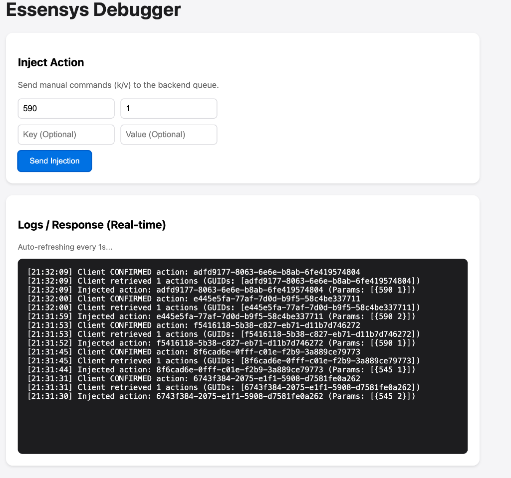

# Interface de Débogage

L'interface de débogage (`/debug`) est un outil intégré au backend pour tester les communications avec les clients Essensys et diagnostiquer les problèmes de scénarios.

## Accès

L'interface est accessible à l'adresse suivante :
`http://mon.essensys.fr/debug`

## Fonctionnalités

### 1. Injection d'Actions (Inject Action)
Cette section permet d'envoyer manuellement des commandes au client (injecter des actions dans la file d'attente du backend).

*   **Key (Clé)** : L'indice de la variable à modifier (ex: `590` pour déclencher un scénario, `619` pour une lumière).
*   **Value (Valeur)** : La valeur à affecter.

**Exemple "Allumer Couloir" :**
*   Key: `619`
*   Value: `4`

**Exemple "Déclencher Scénario 2 (Je sors)" :**
*   Key: `590`
*   Value: `1` (Confirmation)

### 2. Logs Temps Réel (Logs / Response)
Cette section affiche les traces de communication backend/client en temps réel.

*   **Injected action** : Indique que votre commande manuelle a été reçue par le backend et mise en file d'attente (avec un GUID unique).
*   **Client retrieved ... actions** : Indique que le client (le boîtier Essensys) a fait une requête `GET /api/myactions` et a récupéré la commande. C'est la preuve que le "polling" fonctionne.
*   **Client CONFIRMED action** : Indique que le client a envoyé une requête `POST /api/done/{guid}` pour confirmer qu'il a bien reçu et traité l'action.

## Diagnostic

*   **Si vous voyez "Injected" mais jamais "Retrieved"** : Le client n'est probablement pas connecté ou ne poll pas l'API correctement. Vérifiez la connectivité réseau du boîtier.
*   **Si vous voyez "Retrieved" mais jamais "Confirmed"** : Le client reçoit la commande mais échoue à la traiter (bug firmware) ou à envoyer la confirmation.
## Référence des Commandes (Basé sur Scenario 1)

Voici la liste des constantes pour l'injection manuelle, basées sur les indices du **Scenario 1** (Zone de test recommandée).

**Pour exécuter une commande :**
1.  Injectez les valeurs dans les clés ci-dessous (ex: `611:1` pour allumer entrée).
2.  (Optionnel) Si nécessaire, déclenchez le scénario 1 en injectant `590:1` (Index `Scenario`).

### Éclairage - ALLUMER

| Constante | Clé | Valeur | Description |
| :--- | :--- | :--- | :--- |
| **Sce_Allumer_PDV_LSB** | **611** | `1` | Lampe Entrée |
| | | `2` | Lampe Salon 1 |
| | | `4` | Lampe Salon 2 |
| | | `8` | Lampe Dressing 1 |
| | | `16` | Lampe Dressing 2 |
| **Sce_Allumer_PDV_MSB** | **612** | `32` | Variateur Bureau |
| | | `64` | Variateur Salle à Manger |
| | | `128` | Variateur Salon |
| **Sce_Allumer_CHB_LSB** | **613** | `1` | Lampe Escalier |
| | | `2` | Lampe Grande Chambre 1 |
| | | `4` | Lampe Grande Chambre 2 |
| | | `8` | Lampe Petite Chambre 1 (1) |
| | | `16` | Lampe Petite Chambre 1 (2) |
| | | `32` | Lampe Petite Chambre 2 |
| | | `64` | Lampe Petite Chambre 3 |
| **Sce_Allumer_CHB_MSB** | **614** | `16` | Variateur Petite Chambre 3 |
| | | `32` | Variateur Petite Chambre 2 |
| | | `64` | Variateur Petite Chambre 1 |
| | | `128` | Variateur Grande Chambre |
| **Sce_Allumer_PDE_LSB** | **615** | `1` | Lampe Cuisine 1 |
| | | `2` | Lampe Cuisine 2 |
| | | `4` | Lampe SDB 1 |
| | | `8` | Lampe SDB 2 (1) |
| | | `16` | Lampe SDB 2 (2) |
| | | `32` | Lampe WC 1 |
| | | `64` | Lampe WC 2 |
| | | `128` | Lampe Service |
| **Sce_Allumer_PDE_MSB** | **616** | `1` | Lampe Dégagement 1 |
| | | `2` | Lampe Dégagement 2 |
| | | `4` | Lampe Terrasse |
| | | `8` | Lampe Annexe 1 |
| | | `16` | Lampe Annexe 2 |
| | | `128` | Variateur SDB 1 |

### Éclairage - ÉTEINDRE

| Constante | Clé | Valeur | Description |
| :--- | :--- | :--- | :--- |
| **Sc_Eteindre_PDV_LSB** | **605** | `1...255` | Entrée, Salon, Dressing (Mêmes bits que Allumer) |
| **Sc_Eteindre_PDV_MSB** | **606** | `32...128` | Variateurs PDV |
| **Sc_Eteindre_CHB_LSB** | **607** | `1...64` | Lampes Chambres |
| **Sc_Eteindre_CHB_MSB** | **608** | `16...128` | Variateurs Chambres |
| **Sce_Eteindre_PDE_LSB** | **609** | `1...128` | Lampes Pièces d'Eau |
| **Sce_Eteindre_PDE_MSB** | **610** | `1...128` | Lampes/Var Pièces d'Eau |

### Volets & Stores - OUVRIR

| Constante | Clé | Valeur | Description |
| :--- | :--- | :--- | :--- |
| **Sce_OuvrirVolets_PDV** | **617** | `1` | Volet Salon 1 |
| | | `2` | Volet Salon 2 |
| | | `4` | Volet Salon 3 |
| | | `8` | Volet SAM 1 |
| | | `16` | Volet SAM 2 |
| | | `32` | Volet Bureau |
| **Sce_OuvrirVolets_CHB** | **618** | `1` | Volet Grande Chambre 1 |
| | | `2` | Volet Grande Chambre 2 |
| | | `4` | Volet Petite Chambre 1 |
| | | `8` | Volet Petite Chambre 2 |
| | | `16` | Volet Petite Chambre 3 |
| **Sce_OuvrirVolets_PDE** | **619** | `1` | Volet Cuisine 1 |
| | | `2` | Volet Cuisine 2 |
| | | `4` | Volet SDB 1 |
| | | `8` | Remonter Store Terrasse |

### Volets & Stores - FERMER

| Constante | Clé | Valeur | Description |
| :--- | :--- | :--- | :--- |
| **Sce_FermerVolets_PDV** | **620** | `1...32` | Volets PDV (Mêmes bits que Ouvrir) |
| **Sce_FermerVolets_CHB** | **621** | `1...16` | Volets Chambres |
| **Sce_FermerVolets_PDE** | **622** | `1...8` | Volets PDE / Sortir Store |

### Scénarios & Sécurité

| Constante | Clé | Valeur | Description |
| :--- | :--- | :--- | :--- |
| **Sc_Alarme_ON** | **593** | `1` | Mettre l'alarme |
| | | `2` | Enlever l'alarme |
| **Sce_Securite** | **623** | `1` | Couper prises sécurité |
| | | `2` | Remettre prises sécurité |
| **Sce_Machines** | **624** | `1` | Couper machines à laver |
| | | `2` | Remettre machines à laver |
| **Scenario** | **590** | `1...8` | **DÉCLENCHER UN SCÉNARIO** (1=Scen1) |

