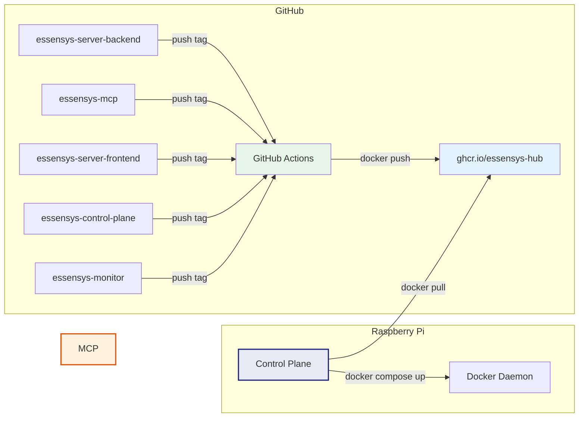
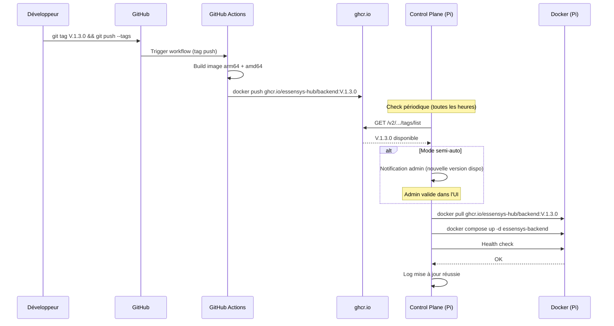

# CI/CD Pipeline

## Vue d'ensemble

Chaque repo Essensys dispose de son propre pipeline GitHub Actions qui build et publie une image Docker sur **GitHub Container Registry** (`ghcr.io`).



## Workflow type (GitHub Actions)

Voici le workflow pour le build multi-architecture d'une image Docker. Ce même pattern s'applique à chaque repo.

```yaml
# .github/workflows/docker-build.yml
name: Build & Push Docker Image

on:
  push:
    tags:
      - 'V.*'
  workflow_dispatch:
    inputs:
      version:
        description: 'Version tag'
        required: true

permissions:
  contents: read
  packages: write

jobs:
  build:
    runs-on: ubuntu-latest
    steps:
      - name: Checkout
        uses: actions/checkout@v4

      - name: Set up QEMU
        uses: docker/setup-qemu-action@v3

      - name: Set up Docker Buildx
        uses: docker/setup-buildx-action@v3

      - name: Login to GitHub Container Registry
        uses: docker/login-action@v3
        with:
          registry: ghcr.io
          username: ${{ github.actor }}
          password: ${{ secrets.GITHUB_TOKEN }}

      - name: Extract version
        id: version
        run: |
          if [ "${{ github.event_name }}" = "workflow_dispatch" ]; then
            echo "tag=${{ github.event.inputs.version }}" >> "$GITHUB_OUTPUT"
          else
            echo "tag=${GITHUB_REF#refs/tags/}" >> "$GITHUB_OUTPUT"
          fi

      - name: Build and push
        uses: docker/build-push-action@v5
        with:
          context: .
          push: true
          platforms: linux/arm64,linux/amd64
          tags: |
            ghcr.io/essensys-hub/${{ github.event.repository.name }}:${{ steps.version.outputs.tag }}
            ghcr.io/essensys-hub/${{ github.event.repository.name }}:latest
          build-args: |
            VERSION=${{ steps.version.outputs.tag }}
            GIT_COMMIT=${{ github.sha }}
            BUILD_TIME=${{ github.event.head_commit.timestamp }}
          cache-from: type=gha
          cache-to: type=gha,mode=max
```

## Points clés

### Multi-architecture

Le build utilise `docker buildx` avec QEMU pour produire des images **`linux/arm64`** (Raspberry Pi) et **`linux/amd64`** (dev local, CI). Le Pi tire automatiquement l'image correspondant à son architecture.

### Tagging

| Événement | Tag image | Exemple |
|-----------|-----------|---------|
| Push d'un tag `V.*` | Tag version + `latest` | `ghcr.io/essensys-hub/backend:V.1.3.0` |
| Workflow dispatch | Tag custom + `latest` | `ghcr.io/essensys-hub/backend:hotfix-123` |

### Cache

Le build utilise le cache GitHub Actions (`type=gha`) pour accélérer les builds incrémentaux. Seules les couches modifiées sont re-buildées.

### Registry privé

`ghcr.io` est privé par défaut pour les repos privés. Le Pi a besoin d'un token d'accès :

```bash
# Sur le Pi, login au registry (une seule fois)
echo $GITHUB_TOKEN | docker login ghcr.io -u essensys-hub --password-stdin
```

Ce token peut être provisionné par Ansible ou par le Control Plane lors du setup initial.

## Flux de release


