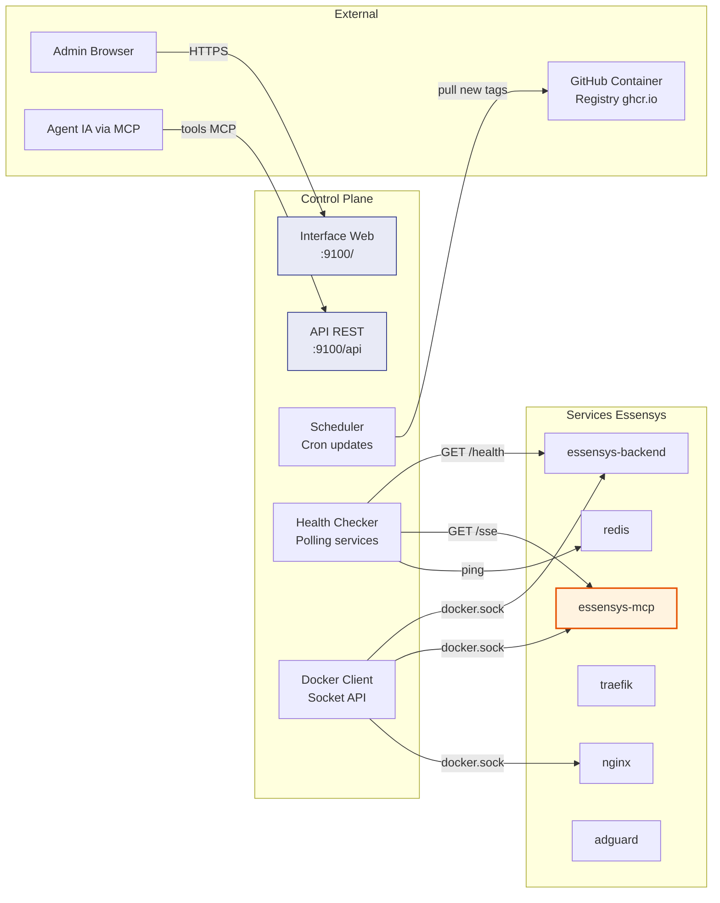
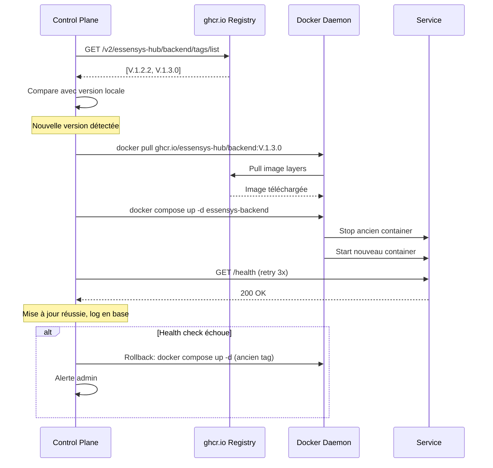
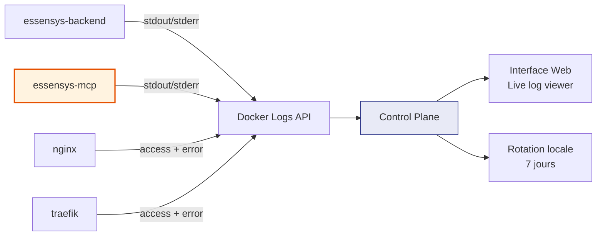
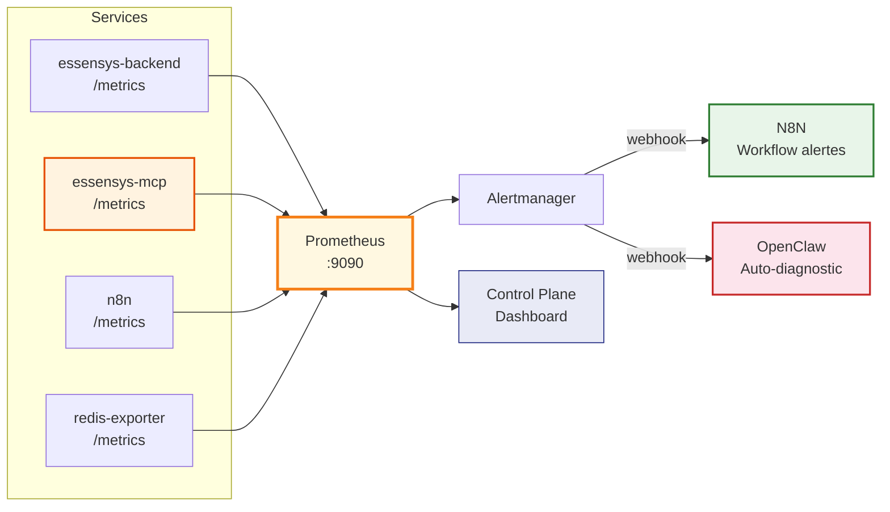
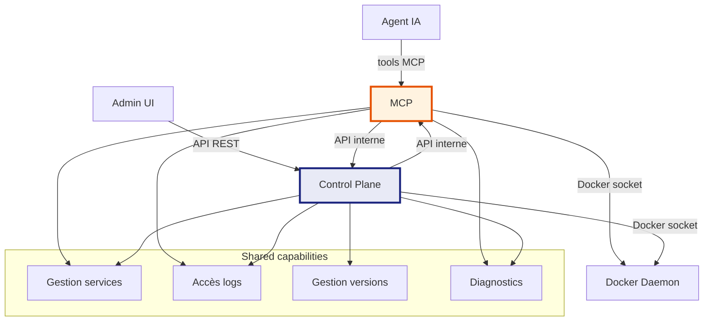

# Control Plane Essensys

Le Control Plane est le cerveau opérationnel de la solution Essensys. Inspiré du modèle UniFi (où un contrôleur centralisé gère tous les équipements), il offre une interface unique pour superviser, mettre à jour et diagnostiquer chaque Raspberry Pi.

## Rôle du Control Plane



## Fonctionnalités

### 1. Dashboard (Vue d'ensemble)

L'interface affiche en temps réel :

| Information | Source | Méthode |
|-------------|--------|---------|
| Statut de chaque service (running/stopped/error) | Docker API | `docker inspect` |
| Version de chaque image déployée | Docker API | Image tag + digest |
| Uptime de chaque container | Docker API | `State.StartedAt` |
| Utilisation CPU / RAM / Disque | `/proc` + Docker stats | `docker stats` |
| Dernière mise à jour réussie | Base locale (SQLite) | Log interne |
| Version disponible sur le registry | ghcr.io API | `GET /v2/.../tags/list` |

```
┌─────────────────────────────────────────────────────────────┐
│  Essensys Control Plane           ⚙ Settings    V.2.0.0    │
├─────────────────────────────────────────────────────────────┤
│                                                             │
│  Service            Status    Version     Available  Action │
│  ─────────────────  ────────  ──────────  ─────────  ────── │
│  essensys-backend   ● Running V.1.2.2    V.1.3.0    Update │
│  essensys-mcp       ● Running V.1.2.2    V.1.2.2    ✓      │
│  nginx              ● Running alpine-1.27 -          -      │
│  traefik            ● Running v2.11.3    v2.11.5    Update │
│  redis              ● Running 7.4-alpine  -          -      │
│  adguard            ● Running v0.107.52  -          -      │
│  mosquitto          ● Running 2.0.18     -          -      │
│  monitor            ● Running V.1.2.2    V.1.2.2    ✓      │
│                                                             │
│  System: CPU 12% | RAM 1.2/4 GB | Disk 45% | Temp 52°C    │
│                                                             │
├─────────────────────────────────────────────────────────────┤
│  Recent Events                                              │
│  10:32 essensys-backend health check OK                     │
│  10:30 essensys-mcp 3 tools called (find_device_index x2)  │
│  10:15 System update check: no new versions                 │
│  09:45 essensys-backend updated V.1.2.1 → V.1.2.2          │
└─────────────────────────────────────────────────────────────┘
```

### 2. Gestion des versions et mises à jour



#### Modes de mise à jour

| Mode | Description | Quand |
|------|-------------|-------|
| **Manuel** | L'admin clique "Update" dans l'UI | Par défaut |
| **Semi-auto** | Le CP télécharge l'image, attend validation | Recommandé production |
| **Auto** | Le CP détecte et déploie automatiquement | Optionnel (comme UniFi) |

### 3. Visualisation des logs

Le Control Plane collecte et affiche les logs de tous les containers :



**Fonctionnalités du viewer de logs :**

- Filtre par service (dropdown)
- Filtre par niveau (INFO, WARN, ERROR)
- Recherche texte libre
- Mode "live tail" (streaming en temps réel via WebSocket)
- Export (téléchargement fichier)

### 4. Métriques et alertes (Prometheus)

Le Control Plane ne gère plus les métriques en interne : il s'appuie sur **Prometheus** comme source de vérité pour les métriques et les alertes.



| Source | Endpoint | Métriques |
|--------|----------|-----------|
| `essensys-backend` | `GET /metrics` | Requêtes API, latence, erreurs, connexions legacy |
| `essensys-mcp` | `GET /metrics` | Tools appelés, sessions SSE, latence Redis, ordres envoyés |
| `control-plane` | `GET /metrics` | Updates effectuées, health checks, Docker stats |
| `n8n` | `GET /metrics` | Workflows exécutés, erreurs, durée |
| `redis` | redis-exporter | Commandes/sec, mémoire, clés |
| `node-exporter` | `GET /metrics` | CPU, RAM, disque, température Pi |

Le Control Plane **query Prometheus** via PromQL pour afficher les graphes dans le dashboard et n'a plus besoin de son propre système de polling.

**Alertes** : Prometheus Alertmanager envoie les alertes vers :

- **N8N** (webhook) : pour les workflows de notification (email, SMS, Telegram, etc.)
- **OpenClaw** (webhook) : pour l'auto-diagnostic et la réparation automatique via MCP

En cas d'alerte :

1. **Warning** (ex: CPU > 80%) → N8N envoie une notification admin
2. **Critical** (ex: service down) → OpenClaw diagnostique via MCP (`run_self_diagnostic`) et tente une réparation
3. **Réparation échouée** → N8N escalade (notification urgente + log dans Control Plane)

## API du Control Plane

```
GET    /api/services              # Liste tous les services + statut
GET    /api/services/:name        # Détail d'un service
POST   /api/services/:name/restart  # Redémarrer un service
POST   /api/services/:name/update   # Mettre à jour vers la dernière version
POST   /api/services/:name/rollback # Rollback à la version précédente

GET    /api/versions              # Versions installées vs disponibles
POST   /api/update/check          # Vérifier les mises à jour maintenant
POST   /api/update/apply          # Appliquer toutes les mises à jour

GET    /api/logs/:service         # Logs d'un service (query: lines, since, level)
GET    /api/logs/:service/stream  # WebSocket stream de logs

GET    /api/system                # Métriques système (CPU, RAM, disk, temp)
GET    /api/system/health         # Health check global

GET    /api/config                # Configuration courante
PUT    /api/config                # Modifier la configuration
```

## Lien avec le MCP

Le Control Plane et le MCP sont **fortement couplés**. Le MCP expose déjà des outils de diagnostic (`list_service_status`, `run_self_diagnostic`, `restart_service`). Dans l'architecture cible :



| Capacité | Control Plane (humain) | MCP (agent IA) | N8N (automation) | OpenClaw (IA) |
|----------|----------------------|----------------|-----------------|--------------|
| Voir statut services | Dashboard UI | `list_service_status` | - | Via MCP |
| Lire les logs | Log viewer UI | `read_service_logs` | - | Via MCP |
| Redémarrer un service | Bouton restart | `restart_service` | Workflow auto | Via MCP |
| Diagnostic complet | Page diagnostics | `run_self_diagnostic` | - | Auto-triggered |
| Mettre à jour | Bouton update | Futur: `update_service` | Workflow update | - |
| Rollback | Bouton rollback | Futur: `rollback_service` | Workflow rollback | - |
| Métriques | Graphes Prometheus | `get_system_metrics` | - | Analyse IA |
| Notifications | UI events | - | Email/SMS/Telegram | Résumé vocal |
| Auto-réparation | - | `run_self_diagnostic` | Workflow triggered | Décision IA |

Le MCP est **l'interface programmatique** du Control Plane. OpenClaw est **l'intelligence** qui prend les décisions. N8N est **l'orchestrateur** qui automatise les workflows entre humains et IA.

## Stack technique recommandée

| Composant | Technologie | Justification |
|-----------|-------------|---------------|
| API | Go (même stack que backend) | Cohérence, performance, accès Docker SDK natif |
| UI | React (même stack que frontend) | Cohérence, réutilisation composants |
| Base de données | SQLite | Léger, pas de service supplémentaire |
| Métriques | Prometheus | Standard industrie, PromQL puissant, alertmanager intégré |
| Communication temps réel | WebSocket | Logs live, statut temps réel |
| Accès Docker | `/var/run/docker.sock` monté en volume | Standard Docker management |
