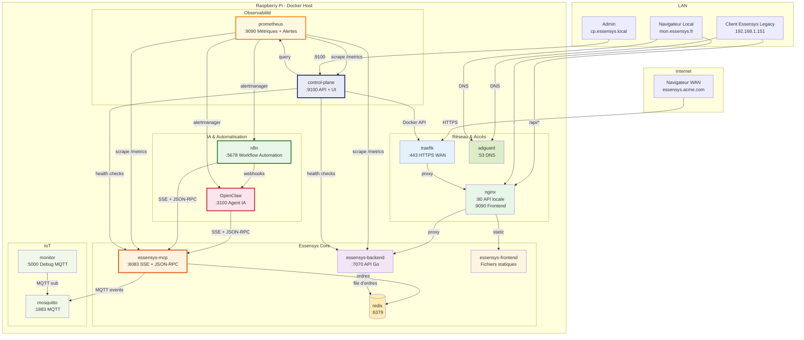

# Migration vers Docker - Vue d'ensemble

Ce document décrit l'architecture cible pour industrialiser la solution Essensys sur Raspberry Pi en utilisant **Docker** comme runtime de containers et un **Control Plane** centralisé pour la gestion des versions, des mises à jour et du monitoring.

## Pourquoi migrer ?

| Problème actuel | Solution Docker |
|----------------|----------------|
| Compilation Go/Node **sur le Pi** (lent, fragile) | Images pré-compilées en CI, le Pi ne fait que `docker pull` |
| Versions hard-codées dans `install.sh` et Ansible | Registry d'images tagguées, versions déclaratives dans `docker-compose.yml` |
| Pas de rollback facile | Rollback = changer le tag image et `docker compose up -d` |
| Dépendances système manuelles (Go, Node, Python) | Tout est embarqué dans les images, le Pi n'a besoin que de Docker |
| Pas de visibilité centralisée | Control Plane avec dashboard pour statut, versions, logs |
| MCP couplé au backend | MCP devient un **service autonome** avec son propre cycle de vie |

## Architecture cible

## Services Docker

### Core Essensys

| Service | Image | Port(s) | Rôle |
|---------|-------|---------|------|
| `essensys-backend` | `ghcr.io/essensys-hub/backend` | 7070 | API Go, communication client legacy |
| `essensys-mcp` | `ghcr.io/essensys-hub/mcp` | 8083 | **Service central** MCP (pilotage IA + diagnostic) |
| `essensys-frontend` | `ghcr.io/essensys-hub/frontend` | - | Build React statique (servi par Nginx) |

### IA & Automatisation

| Service | Image | Port(s) | Rôle |
|---------|-------|---------|------|
| `openclaw` | `ghcr.io/essensys-hub/openclaw` | 3100 | **Agent IA** connecté au MCP pour le pilotage intelligent |
| `n8n` | `n8nio/n8n` | 5678 | **Workflow automation** : scénarios user/IA, notifications, chaînes d'actions |

### Observabilité & Gestion

| Service | Image | Port(s) | Rôle |
|---------|-------|---------|------|
| `prometheus` | `prom/prometheus` | 9090 | **Métriques + alertes** : collecte, stockage, alertmanager → N8N + OpenClaw |
| `control-plane` | `ghcr.io/essensys-hub/control-plane` | 9100 | Dashboard, gestion versions, logs, updates |

### Infrastructure

| Service | Image | Port(s) | Rôle |
|---------|-------|---------|------|
| `nginx` | `nginx:alpine` | 80, 9090 | Reverse proxy local (API + Frontend) |
| `traefik` | `traefik:v2.11` | 443 | Reverse proxy WAN + HTTPS + Basic Auth |
| `redis` | `redis:7-alpine` | 6379 | File d'ordres + cache |
| `adguard` | `adguard/adguardhome` | 53, 3000 | DNS local + filtrage |
| `mosquitto` | `eclipse-mosquitto:2` | 1883 | Broker MQTT |
| `monitor` | `ghcr.io/essensys-hub/monitor` | 5000 | Debug MQTT (Flask + SocketIO) |

## Pages détaillées

- **[Control Plane](control-plane.md)** - Architecture du control plane, interface de gestion, API
- **[MCP Standalone](mcp-standalone.md)** - Séparation du MCP en service autonome
- **[N8N, OpenClaw & Prometheus](n8n-openclaw-prometheus.md)** - Automatisation IA, métriques et alertes
- **[Docker Compose](docker-compose.md)** - Configuration Docker Compose cible
- **[CI/CD Pipeline](cicd.md)** - Build des images et déploiement automatique
- **[Plan de migration](migration-plan.md)** - Migration par phases depuis l'architecture actuelle
