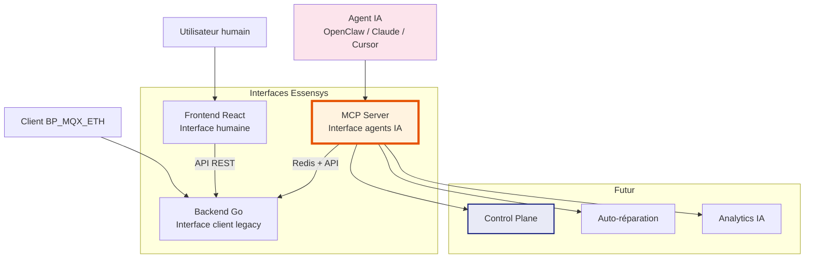
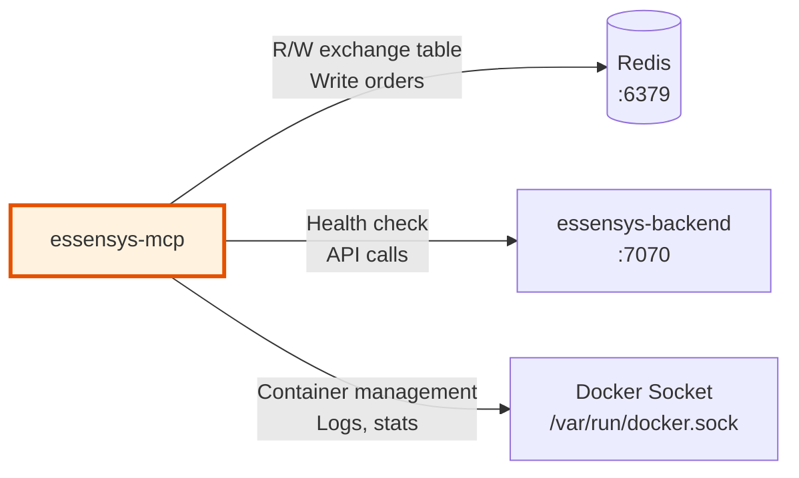

# MCP : Service Standalone Central

## Pourquoi séparer le MCP du Backend ?

Actuellement, le serveur MCP (`cmd/mcp-server/main.go`) vit dans le repo `essensys-server-backend`. Bien qu'il soit compilé et déployé séparément (binaire `essensys-mcp`, service systemd dédié), il partage le code source, les dépendances Go et le cycle de release du backend.

Cette séparation est **critique** pour l'avenir de la solution.

### Le MCP n'est pas un simple outil

Le MCP est le **point d'entrée programmatique** de toute la solution Essensys. Là où le backend gère la communication legacy (client BP_MQX_ETH) et le frontend offre une UI humaine, le MCP est l'interface pour les **agents IA** :



### Raisons de la séparation

| Raison | Explication |
|--------|-------------|
| **Cycle de release indépendant** | Le MCP évolue plus vite que le backend (nouveaux tools, intégrations). Pouvoir le mettre à jour sans toucher au backend est essentiel |
| **Scalabilité** | Le MCP peut avoir besoin de plus de ressources (connexions SSE simultanées). Le séparer permet de le scaler indépendamment |
| **Fiabilité** | Un crash du MCP ne doit pas impacter le backend (et inversement). Isolation des pannes |
| **Testabilité** | Tests unitaires et d'intégration du MCP sans charger tout le backend |
| **Futur Control Plane** | Le MCP sera l'interface programmatique du Control Plane. Il doit être un citoyen de première classe, pas un sous-module |
| **Réutilisabilité** | Le MCP pourrait à terme piloter d'autres backends (pas uniquement Essensys legacy) |

## Architecture du MCP standalone

### Repo dédié : `essensys-mcp`

```
essensys-mcp/
├── cmd/
│   └── mcp-server/
│       └── main.go              # Point d'entrée
├── internal/
│   ├── server/
│   │   ├── sse.go               # Transport SSE
│   │   └── handler.go           # HTTP handlers
│   ├── tools/
│   │   ├── exchange.go          # read/write exchange table
│   │   ├── device.go            # find_device_index
│   │   ├── order.go             # send_order (+ normalisation legacy)
│   │   ├── diagnostic.go        # list_service_status, run_self_diagnostic
│   │   ├── logs.go              # read_service_logs
│   │   ├── system.go            # get_system_metrics, get_port_diagnostics
│   │   └── controlplane.go      # Futurs tools: update_service, rollback...
│   ├── redis/
│   │   └── client.go            # Connexion Redis (ordres + échange)
│   ├── docker/
│   │   └── client.go            # Docker API client (pour diagnostic/CP)
│   └── config/
│       └── config.go            # Configuration (env, YAML, flags)
├── Dockerfile                   # Multi-stage build
├── go.mod
├── go.sum
├── config.yaml.example
└── README.md
```

### Dépendances du MCP



| Dépendance | Type | Usage |
|------------|------|-------|
| **Redis** | Requis | Lecture/écriture table d'échange, file d'ordres |
| **Docker socket** | Requis (mode CP) | Diagnostic services, restart, logs, stats |
| **Backend API** | Optionnel | Health check, info serveur |

### Outils MCP : actuels et futurs

#### Outils de pilotage (existants)

| Outil | Description | Dépendance |
|-------|-------------|------------|
| `read_exchange_table` | Lire toute la table d'échange d'un client | Redis |
| `read_exchange_value` | Lire une valeur par index | Redis |
| `set_exchange_value` | Écrire un index (debug uniquement) | Redis |
| `find_device_index` | Rechercher un device par nom/catégorie/action | Redis |
| `send_order` | Envoyer un ordre à la file globale | Redis |
| `download_essensys_skill` | Télécharger le skill pack Essensys | Redis |

#### Outils de diagnostic (existants)

| Outil | Description | Dépendance |
|-------|-------------|------------|
| `list_service_status` | Statut de tous les services | Docker |
| `read_service_logs` | Logs d'un service | Docker |
| `restart_service` | Redémarrer un service | Docker |
| `get_port_diagnostics` | Vérifier les ports réseau | Système |
| `get_system_metrics` | CPU, RAM, disque, température | Système |
| `run_self_diagnostic` | Diagnostic complet + auto-repair | Docker + Redis |

#### Outils Control Plane (futurs)

| Outil | Description | Dépendance |
|-------|-------------|------------|
| `check_updates` | Vérifier les nouvelles versions disponibles | ghcr.io API |
| `update_service` | Mettre à jour un service vers une version spécifique | Docker + Registry |
| `rollback_service` | Rollback à la version précédente | Docker |
| `get_update_history` | Historique des mises à jour | SQLite (CP) |
| `get_service_config` | Lire la configuration d'un service | Docker + Volumes |
| `set_service_config` | Modifier la configuration d'un service | Docker + Volumes |

## Dockerfile

```dockerfile
# === Stage 1: Build ===
FROM golang:1.23-alpine AS builder
WORKDIR /app
COPY go.mod go.sum ./
RUN go mod download
COPY . .
ARG VERSION=dev
ARG GIT_COMMIT=unknown
ARG BUILD_TIME=unknown
RUN CGO_ENABLED=0 go build \
    -ldflags "-X main.version=${VERSION} -X main.gitCommit=${GIT_COMMIT} -X main.buildTime=${BUILD_TIME}" \
    -o essensys-mcp ./cmd/mcp-server

# === Stage 2: Runtime ===
FROM alpine:3.19
RUN apk add --no-cache ca-certificates
COPY --from=builder /app/essensys-mcp /usr/local/bin/essensys-mcp
EXPOSE 8083
ENTRYPOINT ["essensys-mcp"]
```

L'image finale fait environ **15-20 Mo** (binaire Go statique dans Alpine).

## Configuration

```yaml
# config.yaml
server:
  port: 8083
  token_file: /etc/essensys/mcp.token

redis:
  addr: redis:6379
  password: ""
  db: 0

docker:
  socket: /var/run/docker.sock

backend:
  url: http://essensys-backend:7070

logging:
  level: info
  format: json
```

En Docker, les variables d'environnement surchargent la config YAML :

```bash
MCP_SERVER_PORT=8083
MCP_REDIS_ADDR=redis:6379
MCP_DOCKER_SOCKET=/var/run/docker.sock
MCP_BACKEND_URL=http://essensys-backend:7070
```

## Migration depuis le backend

### Étapes

1. **Créer le repo `essensys-mcp`** sur GitHub
2. **Extraire** le code de `cmd/mcp-server/` et les packages associés
3. **Ajouter** le `Dockerfile` multi-stage
4. **CI/CD** : GitHub Actions pour build + push vers `ghcr.io/essensys-hub/mcp`
5. **Mettre à jour** `docker-compose.yml` pour utiliser la nouvelle image
6. **Supprimer** le code MCP du repo backend
7. **Mettre à jour** le rôle Ansible `raspberry_mcp` pour la période de transition

### Ce qui change

| Aspect | Avant | Après |
|--------|-------|-------|
| Repo | `essensys-server-backend/cmd/mcp-server/` | `essensys-mcp/` (repo dédié) |
| Build | Compilé sur le Pi par Ansible | Image Docker pré-compilée en CI |
| Déploiement | `go build` + copie binaire | `docker pull` + `docker compose up` |
| Configuration | `/etc/essensys/mcp.token` + flags CLI | `config.yaml` + env vars + Docker secrets |
| Logs | `journalctl -u essensys-mcp` | `docker logs essensys-mcp` (+ Control Plane) |
| Mise à jour | Re-run Ansible | Control Plane ou `docker compose pull` |

### Ce qui ne change pas

- **Protocole** : SSE + JSON-RPC (aucun changement côté client/agent)
- **Port** : 8083
- **Authentification** : Bearer token
- **Outils MCP** : Même interface, mêmes noms, mêmes paramètres
- **Connexion Redis** : Même format, même base

Les agents IA (OpenClaw, Cursor, Claude) n'ont **aucune modification à faire**. L'URL et le token restent identiques.
