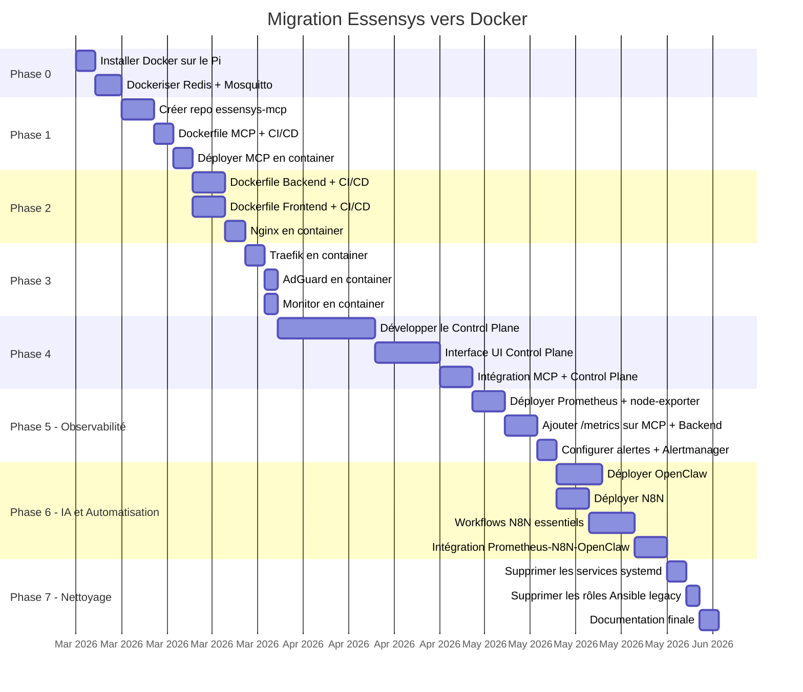

# Plan de migration par phases

La migration vers Docker se fait de manière **incrémentale**, service par service, pour minimiser les risques et permettre un retour arrière à chaque étape.

## Vue d'ensemble des phases



---

## Phase 0 : Prérequis (semaine 1)

**Objectif** : Installer Docker et migrer les services d'infrastructure simples.

### Étapes

1. **Installer Docker Engine** sur Raspberry Pi OS

    ```bash
    curl -fsSL https://get.docker.com | sh
    usermod -aG docker essensys
    systemctl enable docker
    ```

2. **Installer Docker Compose v2** (plugin)

    ```bash
    apt-get install docker-compose-plugin
    ```

3. **Migrer Redis** en container

    ```yaml
    # Redis est sans état persistant critique pour Essensys
    # (la table d'échange est reconstruite par le client)
    services:
      redis:
        image: redis:7-alpine
        ports:
          - "6379:6379"
        restart: unless-stopped
    ```

4. **Migrer Mosquitto** en container

5. **Tester** : vérifier que le backend et le MCP (encore en systemd) se connectent correctement à Redis et Mosquitto dockerisés

### Critère de validation

- `redis-cli ping` → `PONG` depuis le backend systemd
- Le backend écrit et lit dans Redis normalement
- MQTT debug monitor fonctionne

### Rollback

Arrêter les containers, redémarrer redis-server et mosquitto en systemd.

---

## Phase 1 : MCP standalone (semaines 2-3)

**Objectif** : Extraire le MCP du backend, le dockeriser, valider l'indépendance.

!!! warning "Phase critique"
    Le MCP est le service le plus stratégique. C'est le premier à migrer car :
    
    - Il sera la base du Control Plane
    - Son cycle de release doit devenir indépendant
    - Il valide toute la chaîne CI/CD (build image → registry → pull sur Pi)

### Étapes

1. **Créer le repo `essensys-mcp`** sur GitHub

2. **Extraire le code** de `essensys-server-backend/cmd/mcp-server/` vers le nouveau repo

3. **Écrire le Dockerfile** multi-stage (voir [MCP Standalone](mcp-standalone.md))

4. **Configurer GitHub Actions** pour le build arm64 + push vers ghcr.io

5. **Déployer le container MCP** à côté du backend systemd

    ```yaml
    services:
      essensys-mcp:
        image: ghcr.io/essensys-hub/mcp:V.1.3.0
        ports:
          - "8083:8083"
        volumes:
          - /etc/essensys:/etc/essensys:ro
          - /var/run/docker.sock:/var/run/docker.sock:ro
        environment:
          - MCP_REDIS_ADDR=redis:6379
    ```

6. **Arrêter le service systemd** `essensys-mcp`

7. **Tester** avec un agent IA (OpenClaw) : vérifier que tous les outils MCP fonctionnent

### Critère de validation

- `curl -N -H "Authorization: Bearer $TOKEN" http://localhost:8083/sse` → stream SSE OK
- `find_device_index` + `send_order` fonctionnent depuis un agent
- `list_service_status` voit les containers Docker + les services systemd restants

### Rollback

Arrêter le container MCP, redémarrer le service systemd.

---

## Phase 2 : Backend + Frontend (semaines 3-4)

**Objectif** : Dockeriser les services Essensys principaux.

### Backend

1. **Écrire le Dockerfile** dans `essensys-server-backend/`

    ```dockerfile
    FROM golang:1.23-alpine AS builder
    WORKDIR /app
    COPY . .
    RUN CGO_ENABLED=0 go build -o server ./cmd/server

    FROM alpine:3.19
    COPY --from=builder /app/server /usr/local/bin/server
    COPY --from=builder /app/config.yaml.example /etc/essensys/config.yaml
    EXPOSE 7070
    ENTRYPOINT ["server"]
    ```

2. **CI/CD** : même workflow que le MCP

3. **Déployer**, arrêter le systemd `essensys-backend`

### Frontend

1. **Dockerfile** avec build Node + Nginx pour servir

    ```dockerfile
    FROM node:20-alpine AS builder
    WORKDIR /app
    COPY package*.json ./
    RUN npm ci
    COPY . .
    RUN npm run build

    FROM alpine:3.19
    COPY --from=builder /app/dist /var/www/essensys
    # Les fichiers sont montés en volume par Nginx
    ```

2. L'image frontend n'expose pas de port : elle fournit les fichiers statiques dans un volume partagé avec Nginx

### Nginx

Nginx passe en container avec la config Essensys montée en volume.

!!! note "Client legacy"
    Tester impérativement la communication avec le client BP_MQX_ETH. Si le NAT Docker pose problème, utiliser `network_mode: host` pour Nginx.

### Critère de validation

- Frontend accessible sur `http://mon.essensys.fr/`
- API backend accessible sur `http://mon.essensys.fr/api/serverinfos`
- Client legacy fonctionne normalement (single-packet TCP)

---

## Phase 3 : Services réseau (semaine 5)

**Objectif** : Migrer Traefik et AdGuard en containers.

### Traefik

Traefik a une image Docker officielle et supporte nativement le Docker provider :

```yaml
traefik:
  image: traefik:v2.11
  ports:
    - "443:443"
  volumes:
    - /var/run/docker.sock:/var/run/docker.sock:ro
    - ./traefik.yml:/etc/traefik/traefik.yml:ro
    - acme:/etc/traefik/acme
```

Avantage : Traefik peut auto-détecter les containers Docker via les labels, simplifiant la configuration des routes.

### AdGuard Home

```yaml
adguard:
  image: adguard/adguardhome
  ports:
    - "53:53/tcp"
    - "53:53/udp"
    - "3000:3000"
  volumes:
    - adguard-conf:/opt/adguardhome/conf
    - adguard-work:/opt/adguardhome/work
```

### Monitor

```yaml
monitor:
  image: ghcr.io/essensys-hub/monitor:${ESSENSYS_VERSION}
  ports:
    - "5000:5000"
  environment:
    - MQTT_BROKER=mosquitto
```

### Critère de validation

- HTTPS fonctionne sur `https://essensys.acme.com/`
- DNS local résout `mon.essensys.fr`
- `docker compose ps` : tous les services running
- **Plus aucun service systemd Essensys** (sauf Docker lui-même)

---

## Phase 4 : Control Plane (semaines 6-9)

**Objectif** : Développer et déployer le Control Plane.

### Étapes

1. **Créer le repo `essensys-control-plane`**

2. **Développer l'API** (Go) :
    - Endpoints `/api/services`, `/api/versions`, `/api/logs`, `/api/system`
    - Accès Docker socket pour la gestion des containers
    - Check registry ghcr.io pour les nouvelles versions
    - Base SQLite pour l'historique

3. **Développer l'UI** (React) :
    - Dashboard avec statut de tous les services
    - Page versions avec boutons Update / Rollback
    - Viewer de logs avec filtre et live tail
    - Page système (CPU, RAM, disque, température)

4. **Intégrer avec le MCP** :
    - Le MCP appelle le Control Plane pour les opérations d'infrastructure
    - Le Control Plane appelle le MCP pour les diagnostics
    - Nouveaux outils MCP : `check_updates`, `update_service`, `rollback_service`

5. **Dockeriser et déployer**

### Critère de validation

- Dashboard accessible sur `http://cp.essensys.local:9100/`
- Mise à jour d'un service depuis l'UI
- Rollback fonctionnel
- Logs visibles en temps réel
- Agent IA peut demander un diagnostic complet via MCP

---

## Phase 5 : Observabilité - Prometheus (semaines 10-11)

**Objectif** : Mettre en place la collecte de métriques et les alertes.

### Étapes

1. **Déployer Prometheus** + **node-exporter** (métriques système Pi)

    ```yaml
    prometheus:
      image: prom/prometheus:latest
      ports:
        - "9090:9090"
      volumes:
        - ./config/prometheus/prometheus.yml:/etc/prometheus/prometheus.yml:ro
        - ./config/prometheus/alert-rules.yml:/etc/prometheus/alert-rules.yml:ro
        - prometheus-data:/prometheus

    node-exporter:
      image: prom/node-exporter:latest
      pid: host
      volumes:
        - /proc:/host/proc:ro
        - /sys:/host/sys:ro
      command:
        - '--path.procfs=/host/proc'
        - '--path.sysfs=/host/sys'
    ```

2. **Ajouter `/metrics`** sur le MCP et le Backend (endpoint Prometheus natif en Go avec `promhttp`)

3. **Configurer les règles d'alerte** : service down, CPU élevé, température, disque plein, erreurs MCP

4. **Déployer Alertmanager** : routage vers webhooks (préparation pour N8N et OpenClaw)

5. **Intégrer au Control Plane** : le dashboard query Prometheus au lieu de faire son propre polling

### Critère de validation

- `http://pi:9090/targets` → tous les targets UP
- Alerte `ServiceDown` se déclenche quand on stoppe un container
- Le dashboard Control Plane affiche des graphes depuis Prometheus
- `/metrics` accessible sur le MCP et le Backend

### Rollback

Supprimer les containers Prometheus et node-exporter. Le Control Plane repasse en mode polling direct.

---

## Phase 6 : IA et Automatisation (semaines 12-15)

**Objectif** : Déployer OpenClaw, N8N et connecter le triangle d'intelligence.

!!! tip "Prérequis"
    Prometheus doit être opérationnel (Phase 5) pour que les alertes puissent être routées vers N8N et OpenClaw.

### Étapes

1. **Déployer OpenClaw** comme container Docker

    ```yaml
    openclaw:
      image: ghcr.io/essensys-hub/openclaw:latest
      ports:
        - "3100:3100"
      environment:
        - OPENCLAW_MCP_URL=http://essensys-mcp:8083
        - ANTHROPIC_API_KEY=${ANTHROPIC_API_KEY}
    ```

2. **Déployer N8N** (image officielle)

    ```yaml
    n8n:
      image: n8nio/n8n:latest
      ports:
        - "5678:5678"
      volumes:
        - n8n-data:/home/node/.n8n
    ```

3. **Créer les workflows N8N essentiels** :
    - Notification d'alerte Prometheus (email/WhatsApp/Signal/Telegram)
    - Mise à jour semi-automatique (check registry → notification → approbation → deploy)
    - Forward message utilisateur → OpenClaw → réponse
    - Rapport quotidien (métriques + events)

4. **Configurer Alertmanager** pour router :
    - Alertes `critical` → OpenClaw (auto-diagnostic) + N8N (notification)
    - Alertes `warning` → N8N (notification admin)

5. **Tester le flux complet** : envoyer un message (WhatsApp/Signal/Telegram) → N8N → OpenClaw → MCP → action exécutée → réponse

### Critère de validation

- OpenClaw pilote les équipements via MCP depuis une commande texte
- N8N reçoit les alertes Prometheus et envoie des notifications
- Le flux utilisateur → (WhatsApp/Signal/Telegram) → N8N → OpenClaw → MCP → action fonctionne end-to-end
- OpenClaw auto-diagnostique quand un service est down

### Rollback

Supprimer les containers OpenClaw et N8N. Le système fonctionne normalement sans eux (pas de dépendance critique).

---

## Phase 7 : Nettoyage (semaine 16)

**Objectif** : Supprimer tout le legacy systemd.

1. **Supprimer les services systemd** :
    ```bash
    systemctl disable --now essensys-backend essensys-mcp mqtt-debug
    rm /etc/systemd/system/essensys-*.service
    rm /etc/systemd/system/mqtt-debug.service
    systemctl daemon-reload
    ```

2. **Supprimer les dépendances système** inutiles :
    ```bash
    apt remove --purge golang nodejs npm nginx
    rm -rf /usr/local/go /opt/essensys
    ```

3. **Simplifier `install.sh`** : le script ne fait plus que :
    - Installer Docker
    - Configurer le réseau
    - `docker compose pull && docker compose up -d`

4. **Mettre à jour les rôles Ansible** : optionnel, pour les Pi distants. Les rôles deviennent des wrappers autour de Docker Compose.

5. **Mettre à jour la documentation**

---

## Résumé des risques

| Risque | Impact | Mitigation |
|--------|--------|------------|
| Client legacy incompatible avec NAT Docker | Élevé | Tester tôt (Phase 2). Fallback: `network_mode: host` pour Nginx |
| **RAM insuffisante (Pi 4 Go)** | **Élevé** | **Pi 8 Go recommandé** avec N8N + OpenClaw + Prometheus (~900 Mo ajoutés) |
| Performance Docker sur Pi | Moyen | Overhead ~5%. Acceptable sur Pi 4/8 Go |
| Espace disque (images Docker) | Moyen | Images Alpine minimales. Rotation automatique (`docker system prune`) |
| Temps de build CI arm64 via QEMU | Faible | Cache GitHub Actions. Build ~5-10 min par image |
| Perte de données Redis au restart | Faible | Volume persistant + `appendonly yes` |
| Coût API LLM (OpenClaw) | Moyen | Usage via API externe (Anthropic/OpenAI). Monitorer la consommation via N8N |
| Prometheus rétention disque | Moyen | Limiter `--storage.tsdb.retention.time=30d`. ~500 Mo pour 30 jours |
| N8N workflows complexes | Faible | Commencer simple (4 workflows essentiels), itérer |
