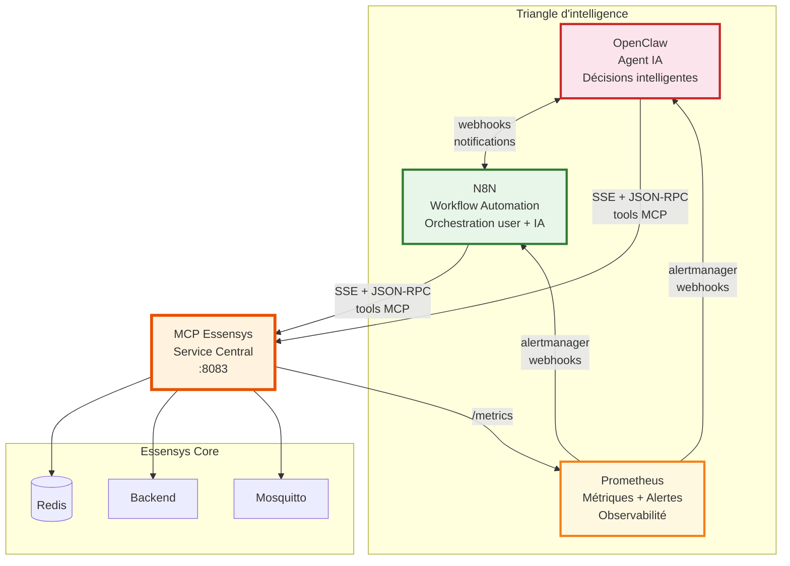
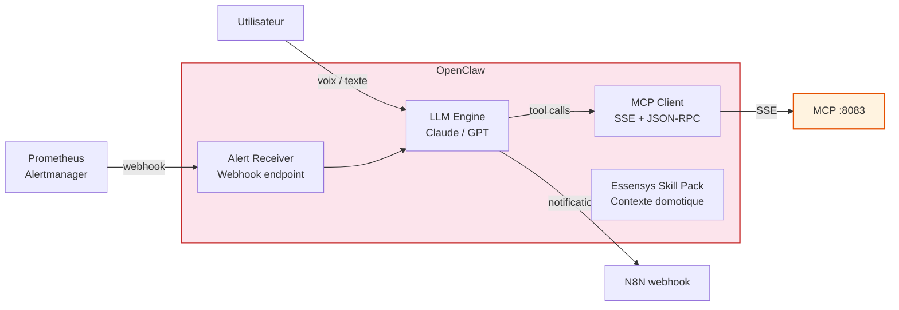
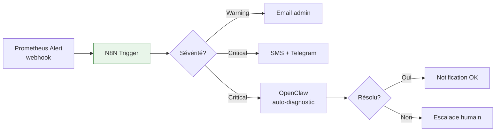
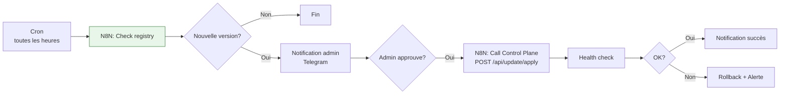
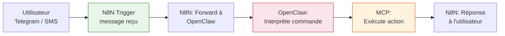
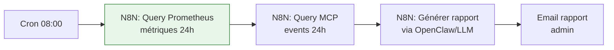
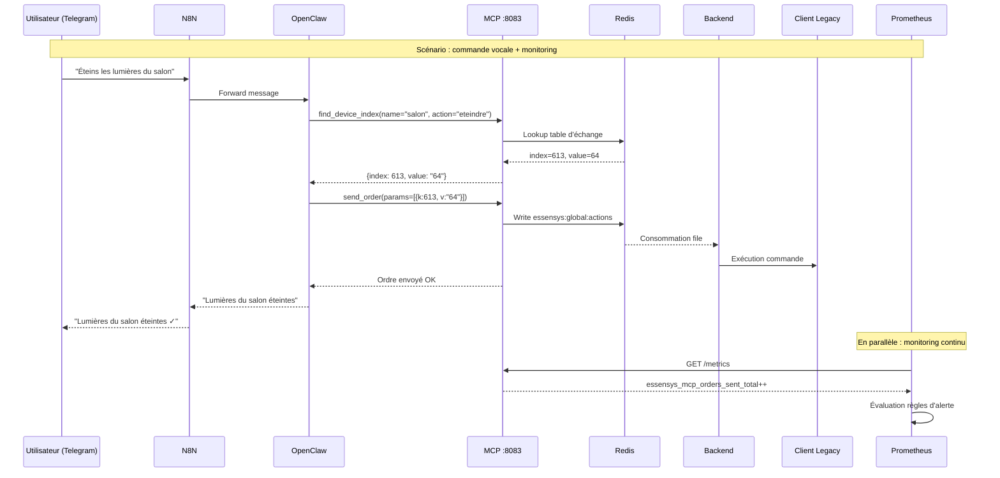

# N8N, OpenClaw & Prometheus

Ces trois modules forment le **triangle d'intelligence** de la solution Essensys : l'automatisation des workflows (N8N), l'intelligence artificielle (OpenClaw) et l'observabilité (Prometheus). Tous trois gravitent autour du **MCP** qui reste le service central.

## Vue d'ensemble



---

## OpenClaw - Agent IA

### Rôle

OpenClaw est l'agent IA qui **pilote Essensys de manière intelligente**. Il se connecte au MCP via SSE et utilise les outils MCP pour :

- **Piloter** les équipements (lumières, volets, scénarios) par commande naturelle
- **Diagnostiquer** les problèmes (via `run_self_diagnostic`, `list_service_status`)
- **Réagir** aux alertes Prometheus (auto-réparation)
- **Apprendre** les habitudes utilisateur pour suggérer des automatisations

### Architecture



### Outils MCP utilisés par OpenClaw

| Outil MCP | Usage OpenClaw |
|-----------|----------------|
| `find_device_index` | Trouver un équipement par nom naturel |
| `send_order` | Exécuter une commande (allumer, éteindre, ouvrir, fermer) |
| `read_exchange_table` | Lire l'état de tous les équipements |
| `read_exchange_value` | Vérifier l'état d'un équipement spécifique |
| `list_service_status` | Vérifier la santé de l'infrastructure |
| `run_self_diagnostic` | Diagnostiquer et réparer automatiquement |
| `read_service_logs` | Analyser les logs pour trouver la cause d'un problème |
| `download_essensys_skill` | Charger le contexte domotique complet |

### Cas d'usage

| Scénario | Déclencheur | Action OpenClaw |
|----------|-------------|-----------------|
| "Éteins les lumières du salon" | Commande utilisateur | `find_device_index` → `send_order` |
| Service backend down | Alerte Prometheus | `run_self_diagnostic(auto_repair=true)` |
| CPU > 90% depuis 5 min | Alerte Prometheus | `get_system_metrics` → analyse → recommandation |
| "Qu'est-ce qui ne marche pas ?" | Commande utilisateur | `list_service_status` + `read_service_logs` → résumé |

### Configuration

```yaml
# openclaw/config.yaml
mcp:
  url: http://essensys-mcp:8083
  token_file: /data/mcp.token

alerts:
  webhook_port: 3100
  webhook_path: /alerts

n8n:
  webhook_url: http://n8n:5678/webhook/openclaw-events

llm:
  provider: anthropic  # ou openai
  model: claude-sonnet-4-20250514
  # api_key via env: ANTHROPIC_API_KEY
```

---

## N8N - Workflow Automation

### Rôle

N8N est le **chef d'orchestre** qui automatise les interactions entre l'utilisateur, l'IA et les services Essensys. Il remplace les scripts bash et les crons par des workflows visuels.

### Pourquoi N8N ?

| Critère | N8N | Scripts bash | Home Assistant |
|---------|-----|-------------|----------------|
| Interface visuelle | Oui (drag & drop) | Non | Oui |
| Self-hosted | Oui | N/A | Oui |
| Intégration MCP | Via HTTP/webhook | curl | Non natif |
| Intégration IA | Nodes LLM natifs | Non | Limité |
| Notifications multi-canal | 400+ intégrations | Manuel | Limité |
| Coût | Gratuit (self-hosted) | Gratuit | Gratuit |
| RAM | ~200 Mo | ~0 | ~500 Mo |

### Workflows essentiels

#### 1. Notification d'alerte Prometheus



#### 2. Mise à jour automatique



#### 3. Interaction utilisateur → IA → Essensys



#### 4. Rapport quotidien



### Exemples de workflows N8N supplémentaires

| Workflow | Trigger | Actions |
|----------|---------|---------|
| **Backup quotidien** | Cron 02:00 | Export Redis → fichier → upload S3/NAS |
| **Détection intrusion** | Alerte Prometheus (port scan) | Notification immédiate + log |
| **Température Pi élevée** | Alerte Prometheus (> 70°C) | Throttle services + notification |
| **Nouveau device connecté** | Event MQTT | Notification + ajout dans registre |
| **Résumé hebdo** | Cron lundi 09:00 | Agrégation métriques → rapport PDF → email |

---

## Prometheus - Métriques & Alertes

### Rôle

Prometheus collecte les métriques de **tous les services**, les stocke en time series, et déclenche des alertes via Alertmanager vers N8N et OpenClaw.

### Configuration

#### prometheus.yml

```yaml
global:
  scrape_interval: 15s
  evaluation_interval: 15s

rule_files:
  - /etc/prometheus/alert-rules.yml

alerting:
  alertmanagers:
    - static_configs:
        - targets:
            - alertmanager:9093

scrape_configs:
  # ─── Essensys Core ───
  - job_name: essensys-backend
    static_configs:
      - targets: ['essensys-backend:7070']
    metrics_path: /metrics

  - job_name: essensys-mcp
    static_configs:
      - targets: ['essensys-mcp:8083']
    metrics_path: /metrics

  # ─── IA & Automation ───
  - job_name: n8n
    static_configs:
      - targets: ['n8n:5678']
    metrics_path: /metrics

  - job_name: openclaw
    static_configs:
      - targets: ['openclaw:3100']
    metrics_path: /metrics

  # ─── Infrastructure ───
  - job_name: control-plane
    static_configs:
      - targets: ['control-plane:9100']
    metrics_path: /metrics

  - job_name: traefik
    static_configs:
      - targets: ['traefik:8080']
    metrics_path: /metrics

  - job_name: redis
    static_configs:
      - targets: ['redis-exporter:9121']

  # ─── System (Raspberry Pi) ───
  - job_name: node
    static_configs:
      - targets: ['node-exporter:9100']
```

#### Règles d'alerte (alert-rules.yml)

```yaml
groups:
  - name: essensys-services
    rules:
      # Service down
      - alert: ServiceDown
        expr: up == 0
        for: 1m
        labels:
          severity: critical
        annotations:
          summary: "Service {{ $labels.job }} is down"
          description: "{{ $labels.job }} n'est plus joignable depuis 1 minute."

      # MCP : aucune connexion SSE active
      - alert: MCPNoActiveConnections
        expr: essensys_mcp_active_sse_connections == 0
        for: 5m
        labels:
          severity: warning
        annotations:
          summary: "Aucun agent connecté au MCP"

      # MCP : erreurs send_order
      - alert: MCPOrderErrors
        expr: rate(essensys_mcp_send_order_errors_total[5m]) > 0.1
        for: 2m
        labels:
          severity: critical
        annotations:
          summary: "Erreurs d'envoi d'ordres MCP"

  - name: raspberry-system
    rules:
      # CPU élevé
      - alert: HighCPU
        expr: 100 - (avg by(instance) (rate(node_cpu_seconds_total{mode="idle"}[5m])) * 100) > 80
        for: 5m
        labels:
          severity: warning
        annotations:
          summary: "CPU > 80% depuis 5 minutes"

      # Température élevée
      - alert: HighTemperature
        expr: node_hwmon_temp_celsius > 70
        for: 2m
        labels:
          severity: warning
        annotations:
          summary: "Température Pi > 70°C"

      # Disque plein
      - alert: DiskSpaceLow
        expr: (node_filesystem_avail_bytes{mountpoint="/"} / node_filesystem_size_bytes{mountpoint="/"}) < 0.15
        for: 5m
        labels:
          severity: warning
        annotations:
          summary: "Moins de 15% d'espace disque libre"

      # RAM élevée
      - alert: HighMemory
        expr: (1 - node_memory_MemAvailable_bytes / node_memory_MemTotal_bytes) > 0.85
        for: 5m
        labels:
          severity: warning
        annotations:
          summary: "RAM > 85% utilisée"

  - name: n8n-workflows
    rules:
      - alert: N8NWorkflowErrors
        expr: rate(n8n_workflow_execution_errors_total[10m]) > 0.05
        for: 5m
        labels:
          severity: warning
        annotations:
          summary: "Erreurs dans les workflows N8N"
```

#### Alertmanager → N8N + OpenClaw

```yaml
# alertmanager.yml
global:
  resolve_timeout: 5m

route:
  receiver: default
  group_by: ['alertname', 'job']
  group_wait: 30s
  group_interval: 5m
  repeat_interval: 1h
  routes:
    # Alertes critiques → OpenClaw (auto-repair) + N8N (notification)
    - match:
        severity: critical
      receiver: critical-alerts
    # Warnings → N8N uniquement (notification admin)
    - match:
        severity: warning
      receiver: warning-alerts

receivers:
  - name: default
    webhook_configs:
      - url: http://n8n:5678/webhook/prometheus-alerts

  - name: critical-alerts
    webhook_configs:
      - url: http://n8n:5678/webhook/prometheus-alerts
      - url: http://openclaw:3100/alerts

  - name: warning-alerts
    webhook_configs:
      - url: http://n8n:5678/webhook/prometheus-alerts
```

### Métriques exposées par le MCP (endpoint `/metrics`)

Le MCP doit exposer des métriques Prometheus. Voici les métriques recommandées :

```
# ─── Connexions ───
essensys_mcp_active_sse_connections      # Nombre de sessions SSE actives
essensys_mcp_total_connections           # Total connexions depuis le démarrage

# ─── Outils appelés ───
essensys_mcp_tool_calls_total{tool="find_device_index"}
essensys_mcp_tool_calls_total{tool="send_order"}
essensys_mcp_tool_calls_total{tool="read_exchange_table"}
essensys_mcp_tool_calls_total{tool="run_self_diagnostic"}
essensys_mcp_tool_duration_seconds{tool="send_order"}

# ─── Ordres ───
essensys_mcp_orders_sent_total           # Ordres envoyés avec succès
essensys_mcp_send_order_errors_total     # Erreurs d'envoi

# ─── Redis ───
essensys_mcp_redis_latency_seconds       # Latence Redis
essensys_mcp_redis_errors_total          # Erreurs Redis

# ─── Système ───
essensys_mcp_uptime_seconds              # Uptime du service
essensys_mcp_version_info{version="V.1.2.2", commit="abc123"}  # Info version
```

### Impact mémoire sur Raspberry Pi

| Service | RAM estimée | Justification |
|---------|-------------|---------------|
| Prometheus | ~150-300 Mo | Dépend du nombre de métriques et de la rétention |
| N8N | ~200-400 Mo | Node.js, dépend du nombre de workflows actifs |
| OpenClaw | ~100-200 Mo | Go/Python, dépend du LLM (API externe, pas local) |
| **Total ajouté** | **~450-900 Mo** | Sur un Pi 4 Go: serré. **Pi 8 Go recommandé** |

!!! warning "Recommandation mémoire"
    Avec l'ajout de N8N, OpenClaw et Prometheus, un **Raspberry Pi 4 avec 8 Go de RAM** est fortement recommandé. Sur un Pi 4 Go, il faudra tuner les limites mémoire Docker et la rétention Prometheus.

---

## Flux de données global


