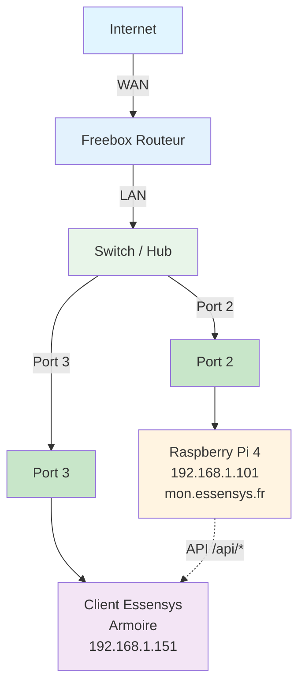

# Configuration Freebox

Configuration du NAT/port forwarding sur Freebox.

## Schéma de connexion réseau

**Connexions :**
- **Port 2** : Raspberry Pi 4 (192.168.1.101)
- **Port 3** : Client Essensys / Armoire (192.168.1.151)
- Le client Essensys communique avec le Raspberry Pi via les API `/api/*`

## NAT/Port Forwarding

### Via l'interface Freebox

1. Se connecter à l'interface Freebox (http://mafreebox.freebox.fr)
2. Aller dans **Paramètres de la Freebox** → **Gestion des ports**
3. Cliquer sur **Ajouter une redirection de port**
4. Configurer :

**Redirection 1 : Port 80**
- **Nom** : Essensys HTTP
- **Protocole** : TCP
- **Port externe** : 80
- **Port interne** : 80
- **IP interne** : 192.168.1.101

**Redirection 2 : Port 443**
- **Nom** : Essensys HTTPS
- **Protocole** : TCP
- **Port externe** : 443
- **Port interne** : 443
- **IP interne** : 192.168.1.101

## Configuration DNS local

La Freebox gère automatiquement le DNS local. Pour ajouter une entrée personnalisée, utiliser l'interface Freebox ou configurer directement sur les machines clientes via `/etc/hosts`.

## Vérification

Vérifier que les redirections sont actives dans l'interface Freebox.
