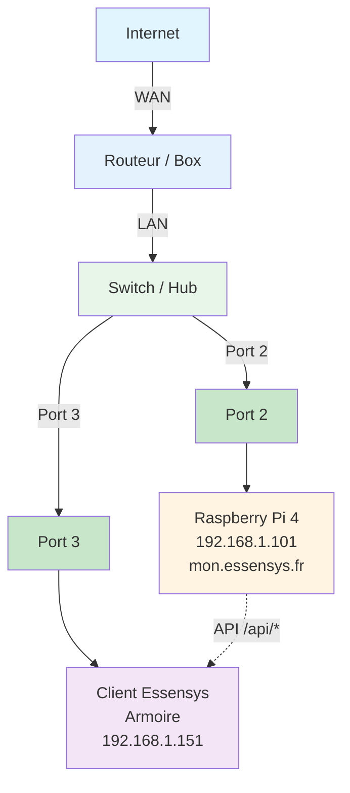

# Configuration Routeur

Cette section explique comment configurer le NAT/port forwarding sur différents routeurs pour permettre l'accès WAN.

## Schéma de connexion réseau général



**Configuration standard :**
- **Port 2 du Switch** : Raspberry Pi 4 (192.168.1.101)
- **Port 3 du Switch** : Client Essensys / Armoire (192.168.1.151)
- Le client Essensys communique avec le Raspberry Pi via les API `/api/*` sur le réseau local

## Sections

1. **[Ubiquiti Dream Machine Pro](ubiquiti-udm-pro.md)** - Configuration sur UDM Pro
2. **[Freebox](freebox.md)** - Configuration sur Freebox
3. **[SFR](sfr.md)** - Configuration sur routeur SFR
4. **[Orange Livebox](orange-livebox.md)** - Configuration sur Orange Livebox

## Vue d'ensemble

Pour permettre l'accès WAN, vous devez configurer :

1. **NAT/Port forwarding** :
   - Port 80 → 192.168.1.101:80
   - Port 443 → 192.168.1.101:443

2. **DNS local** (optionnel) :
   - `mon.essensys.fr` → 192.168.1.101

3. **DNS public** (pour WAN) :
   - `essensys.acme.com` → Votre IP publique

## Ports à rediriger

| Port externe | Port interne | Service |
|--------------|--------------|----------|
| 80 | 80 | Nginx (API locales) |
| 443 | 443 | Traefik (Frontend WAN HTTPS) |

## Test de la configuration

### Test local

```bash
# Depuis le réseau local
curl http://mon.essensys.fr/health
```

### Test WAN

```bash
# Depuis Internet
curl https://essensys.acme.com/
```

