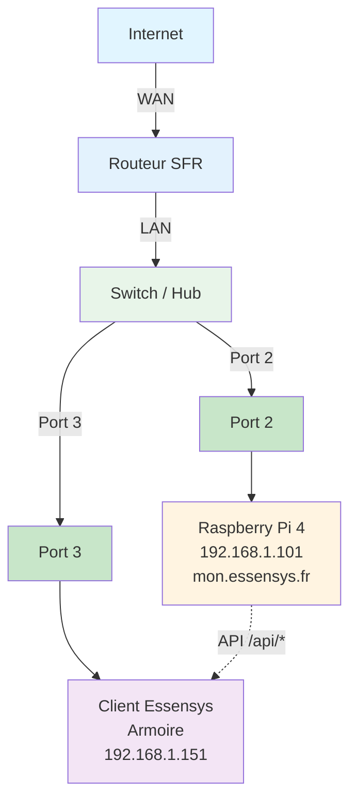

# Configuration SFR

Configuration du NAT/port forwarding sur routeur SFR.

## Schéma de connexion réseau

**Connexions :**
- **Port 2** : Raspberry Pi 4 (192.168.1.101)
- **Port 3** : Client Essensys / Armoire (192.168.1.151)
- Le client Essensys communique avec le Raspberry Pi via les API `/api/*`

## NAT/Port Forwarding

### Via l'interface SFR

1. Se connecter à l'interface du routeur SFR (généralement http://192.168.1.1)
2. Aller dans **Paramètres avancés** → **NAT/PAT** ou **Redirection de ports**
3. Ajouter les règles :

**Règle 1 : Port 80**
- **Nom** : Essensys HTTP
- **Protocole** : TCP
- **Port externe** : 80
- **Port interne** : 80
- **IP interne** : 192.168.1.101

**Règle 2 : Port 443**
- **Nom** : Essensys HTTPS
- **Protocole** : TCP
- **Port externe** : 443
- **Port interne** : 443
- **IP interne** : 192.168.1.101

## Configuration DNS local

Configurer le DNS local via l'interface du routeur ou utiliser `/etc/hosts` sur les machines clientes.

## Vérification

Vérifier que les règles sont actives dans l'interface du routeur.
