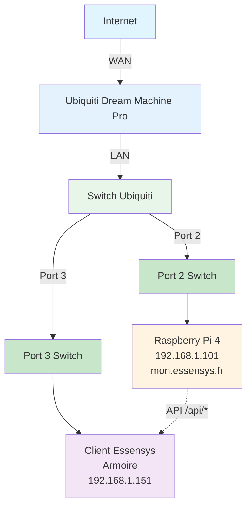

# Configuration Ubiquiti Dream Machine Pro

Configuration du NAT/port forwarding et DNS sur Ubiquiti Dream Machine Pro.

## Schéma de connexion réseau



**Connexions :**
- **Port 2 du Switch** : Raspberry Pi 4 (192.168.1.101)
- **Port 3 du Switch** : Client Essensys / Armoire (192.168.1.151)
- Le client Essensys communique avec le Raspberry Pi via les API `/api/*`

## NAT/Port Forwarding

### Via l'interface Unifi

1. Se connecter à l'interface Unifi Controller
2. Aller dans **Settings** → **Networks** → **WAN**
3. Cliquer sur **Port Forwarding**
4. Ajouter les règles suivantes :

**Règle 1 : Port 80**
- **Name** : Essensys HTTP
- **Port** : 80
- **Forward IP** : 192.168.1.101
- **Forward Port** : 80
- **Protocol** : TCP

**Règle 2 : Port 443**
- **Name** : Essensys HTTPS
- **Port** : 443
- **Forward IP** : 192.168.1.101
- **Forward Port** : 443
- **Protocol** : TCP

### Via SSH (méthode avancée)

Se connecter en SSH au UDM Pro :

```bash
ssh root@<ip-udm-pro>
```

Éditer la configuration :

```bash
vi /mnt/data/udapi-config/port-forwarding.json
```

## Configuration DNS local

### Via l'interface Unifi

1. Aller dans **Settings** → **Networks** → **LAN**
2. Cliquer sur **DHCP** → **DNS**
3. Ajouter une entrée DNS :
   - **Hostname** : `mon.essensys.fr`
   - **IP** : `192.168.1.101`

### Via SSH (persistant)

Se connecter en SSH au UDM Pro :

```bash
ssh root@<ip-udm-pro>
```

Créer/modifier le fichier de configuration DNS :

```bash
vi /mnt/data/udapi-config/dnsmasq.conf
```

Ajouter :
```
host-record=mon.essensys.fr,192.168.1.101
host-record=traefik.essensys.fr,192.168.1.101
```

Redémarrer dnsmasq :

```bash
/etc/init.d/dnsmasq restart
```

### Configuration persistante via config.gateway.json

Pour une configuration persistante qui survit aux mises à jour :

1. Se connecter en SSH au UDM Pro
2. Créer/modifier `/mnt/data/udapi-config/config.gateway.json` :

```json
{
  "service": {
    "dns": {
      "forwarding": {
        "options": [
          "host-record=mon.essensys.fr,192.168.1.101",
          "host-record=traefik.essensys.fr,192.168.1.101"
        ]
      }
    }
  }
}
```

3. Appliquer la configuration :
```bash
/usr/bin/udapi-config-apply
```

## Vérification

### Vérifier le port forwarding

```bash
# Depuis l'interface Unifi
# Aller dans Settings → Networks → WAN → Port Forwarding
# Vérifier que les règles sont actives
```

### Vérifier le DNS

```bash
# Depuis une machine du réseau local
nslookup mon.essensys.fr
# Devrait retourner 192.168.1.101
```

## Dépannage

### Les ports ne sont pas redirigés

1. Vérifier que les règles sont actives dans l'interface Unifi
2. Vérifier que le firewall n'est pas bloquant
3. Vérifier les logs du routeur

### Le DNS ne fonctionne pas

1. Vérifier que la configuration DNS est correcte
2. Redémarrer dnsmasq :
```bash
/etc/init.d/dnsmasq restart
```

3. Vérifier la résolution :
```bash
nslookup mon.essensys.fr
```

